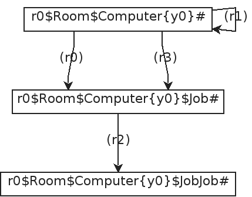
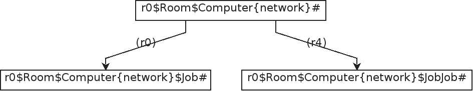
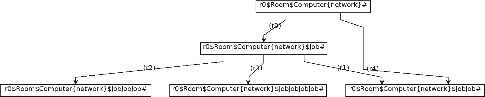

<!--# Simulation-->

In bigraphs, the system's dynamic is represented by means of reaction 
rules of the form $a \to_R a'$ where $a$ and $a'$ are called agents.
A reaction rule comprises a redex and reactum, where the redex is to be
found in an agent; then the matched part of the agent can be rewritten by
the reactum.

> This enables a form of rule-based programming paradigm.

Reaction rule allow some kind of simulation. Specifically, enabled by means of *graph rewriting*.
This form of expression allows to synthesize a labelled transition system (LTS). 
Each node of the LTS is a state. States are connected
by edges denoting the specific reaction rule that lead to this state.
Beginning with an agent, a set of reaction rules is applied as long
as a match can be found, until some stop criteria eventuates or some 
other constraints are applicable. The LTS can have cycles.

## Bigraphical Reactive System (BRS)

A BRS is a system containing an agent and reaction rules.

All reactive system implement the interface `de.tudresden.inf.st.bigraphs.simulation.ReactiveSystem<B extends Bigraph<? extends Signature<?>>>`.

A reactive system for pure bigraphs can be created as follows:

```java
PureReactiveSystem reactiveSystem = new PureReactiveSystem();
```

Then, an agent and reaction rules can be added like this:
```java
reactiveSystem.setAgent(agent);
ReactionRule<PureBigraph> rr = ...;
reactiveSystem.addReactionRule(rr);
```

An _agent_ is any ground bigraph, i.e., a bigraph that has no sites and inner names.
It must also be prime, i.e., it must have only one root.

Some further remarks:
- Predicates for [model checking](verification) can be added using `PureReactiveSystem#addPredicate(ReactiveSystemPredicates<B> predicate)`.
- See [here](simulation-predicates) on how to create predicates.

<!-- ## Examples -->

<!-- ### Home computer example -->

<!-- A room with a computer is modelled with the following dynamics. -->

<!-- - The first and fourth rules are structurally the same but different instances -->
<!-- - The second rule is a no-op rule, just for demonstration purposes -->
<!-- - The third rule allows to create a new "job" on the computer residing in  -->
<!-- the room -->

<!-- The agent of our BRS is shown below with  -->
<!-- the corresponding reaction rules. For the simulation, we set the maximal -->
<!-- allowed transitions to 4.  -->


<!-- ```java -->
<!-- class -->
<!-- ``` -->

## Simulation types   

The frameworks builds the reaction graph in the course of the simulation.
Only the canonical form of an agent is stored in the graph to reduce the
number of admissable states in order to minimize the state-space explosion problem.

### Breadth-first simulation

The algorithm described in [\[1\]](#ref1) is implemented.

The respective reaction graph of the above example is shown below after 
the BFS simulation finished.



This form of simulation provides no guarantee that the simulation will end at some point.

### Random simulation

This type of simulation starts to apply a set of given reaction rules
on an initial agent. After the reaction graph is expanded, the simulation
randomly selects a new state and repeats the process.
In other words, it follows only on path at random until now further rules can be applied.
This form of simulation provides no guarantee that the simulation will end at some point or that the simulation will eventually reach a desired state.

|Random Run #1 | Random Run #2 |
|---|---|
|||

Regarding the first random run of our example (left-hand figure above), rules (r0) and (r4) were applied on the agent. The algorithm
was selecting the second agent (the one where (r4) points to), however, also 
stops here, since no further rules could be applied.

If the agent were chosen (where (r0) points to), rules (r1), (r2) and (r3) could be applied.
This case is illustrated in the right-hand figure above.

## Additional Model Checking Options

Model checking options may be provided to the model checker.
Therefore, the class `ModelCheckingOptions` needs to be created. An
example is shown below.

```java
ModelCheckingOptions opts = ModelCheckingOptions.create();
opts
    .and(transitionOpts()
            .setMaximumTransitions(4)
            .setMaximumTime(30)
            .allowReducibleClasses(true)
            .create()
    )
    .doMeasureTime(true)
    .and(ModelCheckingOptions.exportOpts()
            .setTraceFile(new File("./"))
            .setOutputStatesFolder(new File("./states/"))
            .create()
    )
;
```

The individual options are divided into several categories which can be accessed by
their respective builder classes.
Currently, the following categories are available:

- `ModelCheckingOptions.TransitionOptions`
- `ModelCheckingOptions.ExportOptions`

They are explained in the following.

### Transition options

#### Stopping Criteria
Notice that `ModelCheckingOptions.TransitionOptions` let us specify some stopping criteria by
acquiring its builder by calling `ModelCheckingOptions.TransitionOptions.transitionOpts()`:

- Maximal Number of transitions to allow
- Maximal Number of states to compute
- Time
- Predicates (are explained in [Verification](./verification))

The following methods are available through the `ModelCheckingOptions.exportOpts()` builder instance:

### Export options

The `ModelCheckingOptions.ExportOptions` class allows specifying a file path where the reaction graph (i.e., transition system)
and the individual states shall be written to. If these options are left empty then the graphs are not exported.

The following methods are available through the `ModelCheckingOptions.exportOpts()` builder instance:

| Method  |
|---|
|   |


## References

- \[1\] <a id="ref1" href="https://pure.itu.dk/portal/files/39500908/thesis_GianDavidPerrone.pdf">G. Perrone, “Domain-Specific Modelling Languages in Bigraphs,” IT University of Copenhagen, 2013.</a>


