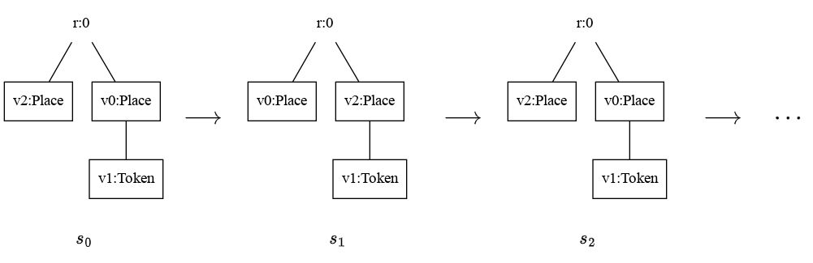

The [Bigraph Ecore Metamodel (BEM)](https://github.com/bigraph-toolkit-suite/bigraphs.bigraph-ecore-metamodel) (version >= 1.5.0) supports the specification of attributes on bigraph nodes.
This page shows how to read and write attributes using a high-level and low-level approach via Bigraph Framework and EMF's API from the BEM specification, respectively.

## Node Attributes API

Bigraph Framework faithfully implements the BEM specification and offers via the class `org.bigraphs.framework.core.impl.BigraphEntity.NodeEntity` the following high-level methods to access and store attributes on nodes.

- `BigraphEntity.NodeEntity#getAttributes(): Map<String, Object>`
- `BigraphEntity.NodeEntity#setAttributes(Map<String, Object> attributes): void`

Node attributes are maps of key-value pairs, where keys are `String`s and values of arbitrary types.

## Bigraph Framework: Usage Example 

In this example, a bigraph is created first consisting of one root with the following three nodes: `A`, `B` and `C`.
Their node IDs are `v0`, `v1`, and `v2`, respectively.
The node with ID `v2` of type `C` is retrieved from the bigraph, and its attribute map.
Then, the integer value `1309` is assigned to the key `data`.
To actually save the attributes, the map has to be supplied to the node again via the `setAttributes()` method.

```java
DefaultDynamicSignature sig = createExampleSignature();
PureBigraphBuilder<DefaultDynamicSignature> b = pureBuilder(sig);
PureBigraph bigraph = b.createRoot()
    .addChild("A")
    .addChild("B")
    .addChild("C")
    .createBigraph(); 
BigraphEntity.NodeEntity<DefaultDynamicControl> v2 = bigraph.getNodes().stream()
    .filter(x -> x.getName().equals("v2")).findAny().get();
Map<String, Object> attributes = v2.getAttributes();
attributes.put("data", 1309);
v2.setAttributes(attributes);
```

## EMF's API: Low-level Access

This section demonstrates the usage of the EMF API of the generated model classes of the BEM specification.

:::info
This approach is just for demonstration purposes.
The Bigraph Framework API as described above provides a semantically leaner interface to create and manipulate bigraphs.
Refer also to the [Rationale of the BEM Specification](https://github.com/bigraph-toolkit-suite/bigraphs.bigraph-ecore-metamodel?tab=readme-ov-file#rationale-of-this-specification) for more details.
:::

The [Bigraph Ecore Metamodel (BEM)](https://github.com/bigraph-toolkit-suite/bigraphs.bigraph-ecore-metamodel) is based on the Eclipse EMF Ecore metamodel.
EMF allows to generate code from those Ecore models.
The BEM specification is shipped with these generated model classes.
These are Java interfaces and implementation classes for all the classes in the BEM model, including factory and package classes.
This offers a low-level interface using the EMF API to read and write attributes of bigraph nodes.

```java
BBigraph bBigraph = BigraphBaseModelFactory.eINSTANCE.createBBigraph();
BRoot bRoot = BigraphBaseModelFactory.eINSTANCE.createBRoot(); // create a root
bBigraph.getBRoots().add(bRoot); // add the root

BPort port21 = BigraphBaseModelFactory.eINSTANCE.createBPort();
BPort port22 = BigraphBaseModelFactory.eINSTANCE.createBPort();
BNode node1 = BigraphBaseModelFactory.eINSTANCE.createBNode();
bRoot.getBChild().add(node1); // add it to the root
node1.setName("A");
// set some attributes
node1.getAttributes().put("key", 123);
node1.getAttributes().put("key2", "ABC");
// add ports to the node
node1.getBPorts().add(port21);
node1.getBPorts().add(port22);
// connect the the ports of the node via an edge
BEdge edge2 = BigraphBaseModelFactory.eINSTANCE.createBEdge();
edge2.getBPoints().add(port21);
edge2.getBPoints().add(port22);
```

## Attribute Preservation

Bigraph Framework uses the jLibBig library for matching and rewriting bigraphs.
See [here](../simulation/simulation-intro) for more details regarding the simulation of bigraphical reactive systems (BRS).
jLibBig also supports attributes on nodes.
Thus, they can be used for conditional reactions in Bigraph Framework.

Attributes are preserved during reactions, i.e., in the course of bigraph rewriting.
The following example demonstrates this behavior.

The running example BRS consists of one rule that moves a `Token` from one `Place` to another `Place`.
The initial state is a simple tree `Place.Token | Place`.

[//]: # (![img]&#40;../assets/advanced/attributes/simple-tree-agent.png&#41;)

When executing the BRS via model checking (`BigraphModelChecker<B extends Bigraph<? extends Signature<?>>>`) for instance, we can observe an infinite behavior of this system.
The `Token` is constantly moved from one `Place` to the other. 



The following example demonstrates the _attribute preservation_ property when performing bigraph rewriting with Bigraph Framework.
This is here achieved by directly accessing the matching and rewriting functionality of the classes `AbstractBigraphMatcher` and `PureReactiveSystem` within the simulation module of Bigraph Framework.
The node with ID `v1` of type `Token` is assigned an attribute before the reaction.
The same attribute is then read again to check that it is preserved.

```java
// Create a signature and the initial state bigraph
DefaultDynamicSignature sig = pureSignatureBuilder()
        .addControl("Place", 0)
        .addControl("Token", 0)
        .create();
PureBigraphBuilder<DefaultDynamicSignature> b = pureBuilder(sig);
PureBigraph bigraph = b.createRoot()
        .addChild("Place").down().addChild("Token").up()
        .addChild("Place")
        .createBigraph();
// Get the node
BigraphEntity.NodeEntity<DefaultDynamicControl> v1 = bigraph.getNodes().stream()
        .filter(x -> x.getName().equals("v1")).findAny().get();
// Assign the attribute
Map<String, Object> attributes = v1.getAttributes();
attributes.put("ip", "192.168.0.1");
v1.setAttributes(attributes);
System.out.println(attributes);

PureBigraphBuilder<DefaultDynamicSignature> bRedex = pureBuilder(sig);
PureBigraphBuilder<DefaultDynamicSignature> bReactum = pureBuilder(sig);
bRedex.createRoot().addChild("Place").down().addChild("Token").up()
        .addChild("Place");
bReactum.createRoot().addChild("Place")
        .addChild("Place").down().addChild("Token").up();
ParametricReactionRule<PureBigraph> rr = new ParametricReactionRule<>(bRedex.createBigraph(), bReactum.createBigraph())
        .withLabel("swapRule");
// Important for tracing nodes through reactions, thus, to correctly preserve attributes
TrackingMap eta = new TrackingMap();
eta.put("v0", "v0");
eta.put("v1", "v2");
eta.put("v2", "v1");
// Assign the tracking map to the rule
rr.withTrackingMap(eta);

// Build a reactive system
PureReactiveSystem rs = new PureReactiveSystem();
rs.setAgent(bigraph);
rs.addReactionRule(rr);
AbstractBigraphMatcher<PureBigraph> matcher = AbstractBigraphMatcher.create(PureBigraph.class);
MatchIterable<BigraphMatch<PureBigraph>> match = matcher.match(bigraph, rr);
Iterator<BigraphMatch<PureBigraph>> iterator = match.iterator();
while (iterator.hasNext()) {
    BigraphMatch<PureBigraph> next = iterator.next();
    PureBigraph result = rs.buildParametricReaction(bigraph, next, rr);
    Map<String, Object> attr = result.getNodes().stream()
            .filter(x -> x.getName().equals("v1")).findAny().get().getAttributes();
    System.out.println(attr);
}
```

The output is as follows:

```text
{ip=192.168.0.1}
{ip=192.168.0.1}
```


:::info Technical Details
The class `org.bigraphs.framework.core.reactivesystem.AbstractSimpleReactiveSystem` is responsible for the copy attribute functionality.

The attribute maps are just copied from the source to the rewritten bigraph (i.e., the target).
Therefore, the node IDs are used for matching.
That is, if we find that some source node ID == some target node ID, the attribute map is copied.
Essentially, this requires the specification of **tracking maps** for all reaction rules in order that attributes can be correctly copied.
Otherwise, the identities of the bigraph elements will get lost during rewriting.
This is because bigraph rewriting resembles a compositional approach of rewriting.
:::