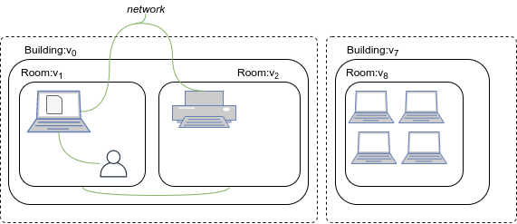

In this section we are going to explain how to construct more complex bigraphs
easily.
We are doing so by using elementary bigraphs or separately building substructures
and combining them later.

## Running Example
Some techniques are presented in the following and may serve as best
practices when modeling bigraphs using Bigraph Framework. We use the
bigraph depicted in the figure below as running example for our explanations.



Two buildings located under different root nodes are shown. The left building
contains two rooms, where the left one comprises a laptop and a user. The user
is connected to the laptop which has on file. The right room only has one printer.
Both the laptop and printer are connected over the same network.
The right building has only one room with 4 laptops.

The **meta model over a signature** of the bigraph depicted in the figure above
can be downloaded [here](../assets/my-meta-model.ecore) to follow along the explanations.

To recreate the running example above, we first need a pure bigraph builder
instance by initializing it with the meta model (see above):
```java
DefaultDynamicSignature signature = BigraphFactory.pureSignatureBuilder()
        .newControl().identifier(StringTypedName.of("Building")).arity(FiniteOrdinal.ofInteger(0)).assign()
        .newControl().identifier(StringTypedName.of("Room")).arity(FiniteOrdinal.ofInteger(1)).assign()
        .newControl().identifier(StringTypedName.of("User")).arity(FiniteOrdinal.ofInteger(1)).assign()
        .newControl().identifier(StringTypedName.of("Laptop")).arity(FiniteOrdinal.ofInteger(2)).assign()
        .newControl().identifier(StringTypedName.of("Printer")).arity(FiniteOrdinal.ofInteger(1)).assign()
        .newControl().identifier(StringTypedName.of("Job")).arity(FiniteOrdinal.ofInteger(1)).assign()
        .create();
PureBigraphBuilder<DefaultDynamicSignature> builder =
        BigraphFactory.pureBuilder(signature, "./my-meta-model.ecore");
```

## Building and Combining (Sub-)Hierarchies

The bigraph builder allows to construct hierarchies separately and to
combine them afterwards.
A pointer is integrated inside the builder which points to the latest created
node. This is important to remember since it allows browsing
the hierarchy. Therefore, the builder provides some special methods that
helps to navigate (see `BigraphBuilder#hierarchy(Control)`, `BigraphBuilder#hierarchy(String)`,
`BigraphBuilder.NodeHierarchy#down()`. `BigraphBuilder.NodeHierarchy#up()`,
`BigraphBuilder.NodeHierarchy#top()`). It will be apparent from the following
usage demonstration on how to use these methods.


Then, we use the builder to create some individual structures.
(It is arbitrarily with which substructure we begin with)
We start with the right building:
```java
PureBigraphBuilder<DefaultDynamicSignature>.Hierarchy buildingRight =
        builder.hierarchy("Building")
        .addChild("Room").down()
            .addChild("Laptop").addChild("Laptop").addChild("Laptop").addChild("Laptop");
```

For the left building, we want to create two substructures for both of the rooms:
```java
PureBigraphBuilder<DefaultDynamicSignature>.Hierarchy roomLeft = builder.hierarchy("Room");
PureBigraphBuilder<DefaultDynamicSignature>.Hierarchy roomRight = builder.hierarchy("Room");
```
It allows us to fill the rooms separately at any time:
```java
// for the left room
BigraphEntity.InnerName login = builder.createInnerName("login");
roomLeft.addChild("User").linkToInner(login)
    .addChild("Laptop", "network").linkToInner(login).down().addChild("Job");
builder.closeInnerName(login);

// for the right room
roomRight.addChild("Printer", "network");
```

Interesting part is that we use an inner name to connect the _laptop_ and
the _user_ but close it later to transform it to an edge. In this case, when
the laptop was created, we connected it already to an outer name (`addChild("Laptop", "network")`).

Finally, we combine all substructures to form one:
```java
builder.createRoot().addChild("Building").down().connectByEdge(roomLeft.top(), roomRight.top());
builder.createRoot().addChild(buildingRight.top());
PureBigraph bigraph = builder.createBigraph();
```
We use the `connectByEdge()` method to conveniently add nodes or hierarchies under
the latest created node at the same time connecting them with an edge.
Important is the usage of `top()` each time a hierarchy is added.
This moves the pointer to the root of the current substructure which is vital
for the operation of the following `addChild()` method. It can be also thought
of "finalizing" a hierarchy.

## Using Elementary Bigraphs

By using elementary bigraphs, one can easily compose multiple bigraphs at
a higher level to achieve the structure as shown in the figure above.

:::info
There are several ways to achieve the bigraph in the figure. We are only
showing one of possibly many ways.
:::
