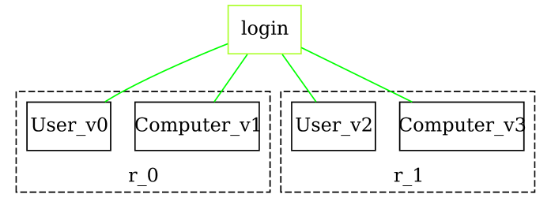
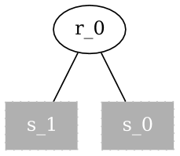
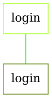
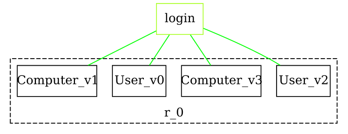

import CodeBlock from '@theme/CodeBlock';
import getting_started_guide_0 from '!!raw-loader!../assets/basics/getting_started_guide-0.java';
import getting_started_guide_1 from '!!raw-loader!../assets/basics/getting_started_guide-1.java';
import getting_started_guide_2 from '!!raw-loader!../assets/basics/getting_started_guide-2.java';
import getting_started_guide_3 from '!!raw-loader!../assets/basics/getting_started_guide-3.java';


Discover what **Bigraph Framework** is all about and learn the core concepts behind it.

## Creating a Bigraph

At the moment, Bigraph Framework supports only _pure bigraphs_.

### Signature

To construct a bigraph, the first step is to define a **signature**.
The signature specifies the **syntax** of the bigraph and determines which **types** (i.e., _controls_) can be used in subsequent modeling steps.

A signature is created via a _signature builder_, which is obtained from a _pure factory_.
All operations that follow are performed through this factory within the current _execution context_.

The entry point is the factory method `BigraphFactory.pureSignatureBuilder()`.

:::tip
Note that all examples use a static import of the `BigraphFactory` class' operations:
```java
import static org.bigraphs.framework.core.factory.BigraphFactory.*;
```
This makes access to its operations more convenient.
:::

<CodeBlock className="language-java">{getting_started_guide_0}</CodeBlock>

As described above, a **signature** specifies the syntax of the bigraph to be created.
In the example below, the resulting signature contains two controls:

- **User** with an *arity* of `1`
- **Computer** with an *arity* of `2`

The **arity** defines how many *connections* a control can have.
The semantic interpretation of “connection” is left abstract here—it may represent, for example, an **Ethernet link**, a **logical association**, or any other type of relationship between elements.

:::info
A more verbose form for creating controls is the following:
```java
sigBuilder
    .newControl().identifier("User").arity(1).status(ControlStatus.ATOMIC).assign()
    .newControl(StringTypedName.of("Computer"), FiniteOrdinal.ofInteger(2)).assign()
```
The control is instantly added to the signature.
Contrary, using `#newControl()` returns a control instance that can be used for other purposes.
:::

### Bigraph Builder

With a signature in place, we can now create a **pure bigraph builder** instance.
The builder provides the operations to construct a bigraph by adding child nodes and defining their connections.

Since the **signature** specifies the available node types (i.e., the syntax of the bigraph), it must be supplied when invoking the factory method
`BigraphFactory.pureBuilder(signature)`.

<CodeBlock className="language-java">{getting_started_guide_1}</CodeBlock>

The example demonstrates how to add two nodes (**User** and **Computer**) under the same root (repeated twice), and how to link them to a shared _outer name_ labeled **"login"**.
The resulting bigraph is illustrated below.

:::info
Note that the method `child()` will throw an `InvalidConnectionException`
if the node cannot be connected to the outer name (because of its arity specified by the
signature).
:::

<center>



</center>

:::tip
For details on how to render and export a bigraph as a graphics file, see the [Visualization](../visualization/visualization-intro) section.
:::


## Elementary Bigraphs

Next, we consider the construction of **elementary bigraphs**.
These are the most basic forms of bigraphs and come in two categories: **Placings** and **Linkings**.
They are **node-free**, meaning they do not contain any nodes.

:::info
Elementary bigraphs are fundamental building blocks in bigraph theory and form the basis for defining the **discrete normal form** of bigraphs.
:::

Elementary bigraphs provide a convenient way to construct more complex structures.
In the following, we illustrate how to create a concrete placing and linking, which we will later use in composition.

:::info
Although elementary bigraphs typically do not require a signature, one must still be supplied for technical reasons.
This is due to the underlying bigraphical metamodel.
For more details, see the project [Bigraph Ecore Metamodel (BEM)](https://github.com/bigraph-toolkit-suite/bigraphs.bigraph-ecore-metamodel).
:::


<!--Note on equality: Object equality at the instance level is not to be compared-->
<!--with mathematical equality of bigraphs. This is also know as bigraph isomorphism problem.-->

The following code example demonstrates how to construct a _merge<sub>n</sub>_
(a placing where _n_ sites are located beneath a single root) and an **identity link graph**
(a link graph in which inner and outer interfaces are directly connected).
In bigraph terminology, the latter can also be interpreted as a **bijective substitution**.

<CodeBlock className="language-java">{getting_started_guide_2}</CodeBlock>

The factory provides the method `#purePlacings()` to create a **placings builder**.
With this builder, we can construct elementary placings such as a _merge_, _join_, or _barren_, among others.

For example, passing the integer `2` as an argument creates a merge with two sites.
In addition, we can create an **identity link graph** with the name `"login"`.

The two resulting elementary bigraphs — **merge** and **identity** — are shown below.


<center>

|Placing: Merge | Linking: Identity |
|---|---|
|  |   |

</center>

## Composition of Bigraphs

Bigraphs can be composed using dedicated **composition operators**.
This enables modular modeling: sub-structures can be defined independently and later combined to form larger bigraphs.

To equip a bigraph with these operators, it is passed to the static method
`BigraphFactory#ops()`, which provides access to the available composition operations.


<CodeBlock className="language-java">{getting_started_guide_3}</CodeBlock>

The code above composes the previously created `bigraph` by merging its two roots:
one placed under root index `0`, the other under root index `1`.
All links are preserved, ensuring that the nodes remain connected through the link graph.

:::info
Composition may throw the exceptions `IncompatibleSignatureException` or `IncompatibleInterfaceException`
if the involved bigraphs use different signatures or incompatible interfaces.

Some operators are introduced in [Composition](composition).
For a complete reference, see the [JavaDoc of the `BigraphComposite` interface](https://bigraphs.org/products/bigraph-framework/apidocs/org/bigraphs/framework/core/BigraphComposite.html).
:::



:::tip
As shown, bigraphs can be constructed using an **operator-based approach** (composition and product).
In addition, the bigraph builder supports the creation of **hierarchies**, which can later be combined into larger structures with ease.

**Example:**
```java
PureBigraphBuilder<DynamicSignature>.Hierarchy h1 = pureBuilder(sig).hierarchy("A");
pureBuilder(sig).root().child(h1);
```
Hierarchies can be created and extended independently, and then added as child nodes at any point in the bigraph.
Links between nodes across different hierarchies should be established via inner or outer names.
:::

## Conclusion

In this page, we introduced the basic features of the **Bigraph Framework**:
how to define signatures, construct bigraphs, create elementary bigraphs, and compose them into larger structures.
