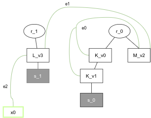

## Encoding a Bigraph to a Ranked Graph

In some cases, bigraphs may be casted to <strong>ranked graphs</strong>, as defined in [\[1\]](#ref1), by exploiting the proposed encoding approach described in [\[2\]](#ref2).

The next listing shows how to encode the bigraph depicted below to a ranked graph.


This bigraph is taken from [\[2\]](#ref2).

```java
PureBigraph bigraph = ...;
PureBigraphRankedGraphEncoding graphEncoding = new PureBigraphRankedGraphEncoding(bigraph);
graphEncoding.encode();
Graph<AbstractRankedGraph.LabeledNode, AbstractRankedGraph.LabeledEdge> graph = graphEncoding.getGraph();
```

Internally, an object of class `org.jgrapht.Graph<V, E>` is created because <a href="https://jgrapht.org/">JGraphT</a> is used to represent the structure of the ranked graph. The graph is an unweighted directed graph allowing multiple edges and refusing self-loops.

The encoded bigraph as ranked graph is illustrated below.


The graphical file is provided by the <i>visualization module</i> of this framework using the [`BigraphRankedGraphExporter`](../visualization/visualization-intro#visualizing-ranked-graphs).


## References

- \[1\] <a id="ref1" href="https://link.springer.com/chapter/10.1007%2F3-540-64299-4_36">Gadducci, F.; Heckel, R.: An inductive view of graph transformation. In: Presicce, F. P. (Hrsg.): Recent Trends in Algebraic Development Techniques, Lecture Notes in Computer Science. Berlin, Heidelberg: Springer, 1998 - ISBN 978-3-540-69719-0, pp. 223–237</a>

- \[2\] <a id="ref2" href="http://www.sciencedirect.com/science/article/pii/S0166218X18303743">Gassara, Amal; Bouassida Rodriguez, Ismael; Jmaiel, Mohamed; Drira, Khalil: Executing bigraphical reactive systems. In: Discrete Applied Mathematics, 14th Cologne-Twente Workshop on Graphs and Combinatorial Optimization (CTW 2016). Bd. 253 (2019), pp. 73–92</a>