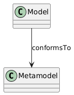

import CodeBlock from '@theme/CodeBlock';
import storing_a_metamodel_to_the_filesystem_0 from '!!raw-loader!../assets/persistence/storing_a_metamodel_to_the_filesystem-0.java';


This page provides a more detailed technical account on the persistence of bigraphical metamodels and their instance models,
as implemented in this framework.

## Metamodeling Concept

For the metamodel the file extension `*.ecore` is used and for the instance model `*.xmi`.

The instance model includes a direct reference to its metamodel which can be used for validation.



Since every bigraph is defined over a **signature**,
the same concept applies for the metamodel and instance model of a signature.


Refer to [Bigraph Ecore Metamodel](https://github.com/bigraph-toolkit-suite/bigraphs.bigraph-ecore-metamodel?tab=readme-ov-file#how-to-use-the-specification), to learn more technical details about the metamodel inside Bigraph Framework.

## Bigraphical Metamodel

To only store the meta-model of a concrete bigraph (i.e., an abstract bigraph over a signature, also called *meta model
over a signature*), we call the method `BigraphFileModelManagement.Store.exportAsMetaModel()`.
Several overloaded methods exist that support, for example, also input streams.

### Storing a metamodel to the filesystem

For demonstration, we create a simple signature and afterward a bigraph

<CodeBlock className="language-java">{storing_a_metamodel_to_the_filesystem_0}</CodeBlock>

As shown above, the metamodel data must be passed to a special method available from `org.bigraphs.framework.core.factory.BigraphFactory`.
The method `exportAsMetaModel(EcoreBigraph, OutputStream)` is used then to output the Ecore representation to the filesystem.

### Loading a metamodel from the filesystem

Note that various overloaded methods exist:

```java
BigraphFileModelManagement.Load.bigraphMetaModel(...);
BigraphFileModelManagement.Load.signatureMetaModel(...);
```

#### Example: Loading the Bigraph Meta-metamodel

Bigraph Framework also contains a bigraph "meta-metamodel" which can be acquired at any time by calling:

```java
EPackage bigraphMetaModel=BigraphFileModelManagement.Load.internalBigraphMetaMetaModel();
```

This metamodel is used to dynamically create bigraphs over user-defined signatures, thus, representing the
meta-metamodel of every metamodel created by a builder instance.

### Changing the Metadata of a Metamodel

We can also pass some additional meta data to the bigraph builder.
This gives us the option to specify the namespace and the URI for the metamodel.
Therefore, the following data structure is needed:

```java
EMetaModelData.builder().setName("sample")
        .setNsPrefix("bigraph").setNsUri("org.example.bigraphs");
```

located in the package `de.tudresden.inf.st.bigraphs.core.datatypes` of the `bigraph-core` module.

Some BigraphFactory methods accept the metadata object.

:::note
Changing the metadata of a metamodel introduces problems concerning model validation.
When modified metamodels are imported again, validation may fail.
:::

## Bigraphical Instance Model

### Storing an instance model to the filesystem

To store an instance model (i.e., a concrete bigraph over a signature):

```java
// create some bigraph via the builder
PureBigraph bigraph=...;
BigraphFileModelManagement.Store.exportAsInstanceModel(bigraph,new FileOutputStream("instance-model.xmi"));
```

To change the namespace location of the corresponding metamodel, you can provide this information as follows:

```java
BigraphFileModelManagement.Store.exportAsInstanceModel(
        bigraph, // the bigraph to export
        new FileOutputStream("instance.xmi"), // the file location
        "./path/to/meta-model.ecore" // the new namespace location of its metamodel
);
```

Signatures are also supported for export:

```java
exportAsInstanceModel(EcoreSignature signature, OutputStream outputStream)
```

### Loading an instance model from the filesystem

Instance models can be loaded directly from the filesystem like this:

```java
List<EObject> eObjects = BigraphFileModelManagement.Load.bigraphInstanceModel("instance.xmi");
```

In the example above, the validity of the instance model is only performed against the bigraph meta-meta-model. However,
when providing a meta-model, the instance model is validated against it:

```java
EPackage metaModel = BigraphFileModelManagement.Load.bigraphMetaModel("meta-model.ecore");
List<EObject> eObjects = BigraphFileModelManagement.Load.bigraphInstanceModel(
        metaModel, // the metamodel
        "instance.xmi" // the file location of the instance model
);
```

:::note
If the metadata of the metamodel was changed, this may produce errors and validation may fail.
:::

