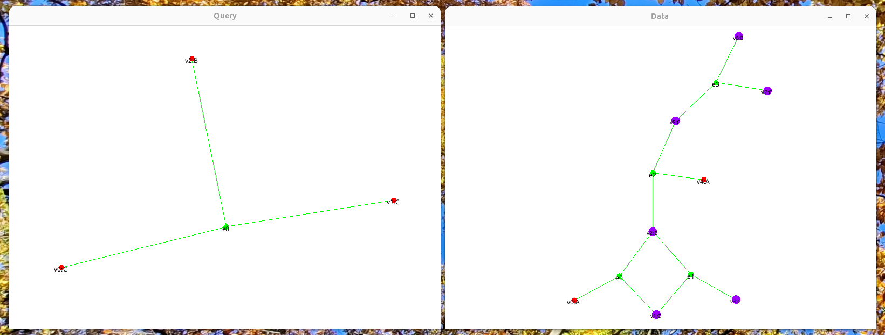

## Overview

Link graphs are essentially hypergraphs: a link (hyperedge) may connect more than two ports of a node in a bigraph.
To answer questions like *“does this wiring pattern occur inside a larger system?”* we need to test whether a query hypergraph is contained in a data hypergraph.
This is known as the subhypergraph isomorphism problem, which generalises subgraph isomorphism.
For bigraphs, this can be referred to as link graph matching.

In the Bigraph Framework the class [`SubHypergraphIsoSearch`](https://github.com/bigraph-toolkit-suite/bigraphs.bigraph-framework/blob/main/simulation/src/main/java/org/bigraphs/framework/simulation/matching/pure/SubHypergraphIsoSearch.java) performs this search.
Given a query and a data link graph, it enumerates all _embeddings_.
Embeddings are _mappings_ of query nodes and hyperedges into the data link graph that preserve adjacency and edge incidence.

:::info Code Example
The complete code example can be found here: [LinkGraphMatchingTests.java](https://github.com/bigraph-toolkit-suite/bigraphs.bigraph-framework/blob/main/simulation/src/test/java/org/bigraphs/framework/simulation/matching/LinkGraphMatchingTests.java#L55)
:::

## Scenario: Query vs. Data

Consider the two link graphs below.  The _query_ on the left contains one hyperedge connecting three nodes labelled `B`, `C` and `C`.
The _data_ on the right contains several hyperedges (green nodes), each connecting three incident nodes.
Some nodes are coloured purple to indicate the mapping from the query to the data link graph.


<figcaption>The goal is to find every occurrence of the query pattern inside the data bigraph (purple color).</figcaption>

## Building the Link Graphs

The first step is to build both the query and the data graphs programmatically.  A `DynamicSignature` is created with three types (`A`, `B`, `C`) each of arity 3, because every node has three ports in our example.
That is, each node can receive up to three links.
Using the `PureBigraphBuilder` the initial data structure and the query are constructed.
Below is the code extracted from `LinkGraphMatchingTests` for the simplest query and the corresponding data graph:

```java
// Define a signature with three controls of arity three
private DynamicSignature sig() {
    return pureSignatureBuilder()
        .add("A", 3)
        .add("B", 3)
        .add("C", 3)
        .create();
}

// Build a query link graph (hypergraph): a single hyperedge connecting C‑C‑B
private PureBigraph createQueryLinkGraph() throws InvalidConnectionException {
    PureBigraphBuilder<DynamicSignature> builder = pureBuilder(sig());
    // connectByEdge creates one hyperedge linking the three specified nodes
    builder.root().connectByEdge("C", "C", "B");
    return builder.create();
}

// Build a data link graph with four hyperedges connecting various triples
private PureBigraph createDataLinkGraph() throws InvalidConnectionException {
    PureBigraphBuilder<DynamicSignature> builder = pureBuilder(sig());
    BigraphEntity.InnerName x1 = builder.createInner("x1");
    BigraphEntity.InnerName x2 = builder.createInner("x2");
    BigraphEntity.InnerName x3 = builder.createInner("x3");
    BigraphEntity.InnerName x4 = builder.createInner("x4");

    builder.root()
        .child("A").linkInner(x1)
        .child("C").linkInner(x1).linkInner(x2)
        .child("B").linkInner(x1).linkInner(x2).linkInner(x3)
        .child("C").linkInner(x2).linkInner(x2)
        .child("A").linkInner(x3)
        .child("C").linkInner(x3).linkInner(x4)
        .child("B").linkInner(x4)
        .child("C").linkInner(x4);

    builder.closeInner();
    return builder.create();
}
```

## Performing the Subhypergraph Matching

Once both link graphs are created, the class `SubHypergraphIsoSearch` needs to be instantiated with the query and data, followed by a call of `embeddings()` to enumerate matches.
Each embedding is a mapping from query nodes to data nodes.

```java
// Create the query and data link graphs
PureBigraph query = createQueryLinkGraph();
PureBigraph data  = createDataLinkGraph();

// Perform subhypergraph isomorphism search
SubHypergraphIsoSearch search = new SubHypergraphIsoSearch(query, data);
search.embeddings();

// Iterate through all embeddings
for (SubHypergraphIsoSearch.Embedding emb : search.getEmbeddingSet()) {
    System.out.println("Embedding:");
    for (Map.Entry<BigraphEntity.NodeEntity<?>, BigraphEntity.NodeEntity<?>> m : emb.entrySet()) {
        System.out.println("Query node " + m.getKey().getName()
                         + " -> Data node " + m.getValue().getName());
    }
}
```

:::tip Visualising Matches
The results can be inspected or used to highlight the matching elements in an [interactive visualization](../visualization/visualization-interactive), as the test does.
GraphStream is used to render the query and data bigraphs, and the matched nodes in the data graph using CSS classes are highlighted.
:::

:::note Algorithm Notes
The subhypergraph matching implementation is based on the work in [\[1\]](#ref1) on efficient searching of subhypergraph isomorphism in hypergraph databases.
Because subhypergraph isomorphism is NP‑complete for general hypergraphs, the performance dependents on the size of the query and the host structure.
:::


## Conclusion

This demonstrated how to use the class `SubHypergraphIsoSearch` to find occurrences of a _query link graph_ inside a larger _data link graph_.
This capability is essential for querying and reasoning about wiring patterns in bigraphs, and it complements the bigraph matching examples covered elsewhere in the documentation.

## References

- \[1\] <a id="ref1" href="https://doi.org/10.1109/BigComp.2018.00140">Ha T.W., Seo J.H., and Kim M.H., “Efficient Searching of Subhypergraph Isomorphism in Hypergraph Databases,” *BigComp 2018*.</a>
