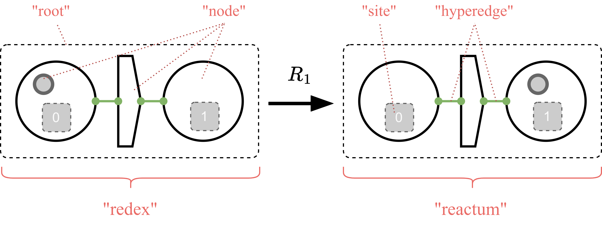

In bigraphs, the dynamic behavior of a system under observation is rooted in process algebra (see [\[2\]](#ref2), [\[3\]](#ref3)) and represented by means of _reactions_ written , where  denote the system states before and after the application of the reaction rule _R_.
This _rewriting formalism_ induces an [observational semantics](https://en.wikipedia.org/wiki/Operational_semantics), where the meaning of a system is characterized by the observable transitions _between_ bigraphical states.
Generally, a _state_ is a bigraphical snapshot of the system at a specific point in time.
Such a state may represent the system at a level of abstraction and fidelity appropriate for the modelling or analysis task under consideration.

Founded on the categorical semantics of bigraph theory (see [\[1\]](#ref1)), this reaction formalism together with the underlying bigraph structure enables the specification and execution of dynamic systems (e.g., simulation or formal verification) within a uniform mathematical framework:

A _Bigraphical Reactive System (BRS)_ acts as an executable system specification that combines the structural representation of a system with its dynamic evolution semantics. Conceptually, a BRS encapsulates:

- the signature, defining the types and constraints,
- the initial state, and
- the reaction rules, specifying how the system may evolve over time.

The following sections provide a technical overview of BRS construction, the anatomy of reaction rules, and the main classes governing the evolution of bigraphs (i.e., system states), before these topics are explained in greater detail in the subsequent sections.

:::info BRS Model Checking
Refer to [Verification](./verification-intro) to get to know more about how to use a BRS specification for model checking.
:::

:::tip Example
Refer to the [Usage Example](./usage-example-brs-simulation), which describes a complete procedure on how to practically use bigraph matching and rewriting in Bigraph Framework.

An overview of the most important classes is also listed on this page in section [Changing Bigraphs over Time: Overview](#changing-bigraphs-over-time-overview).
:::


## Bigraphical Reactive System (BRS)

A BRS is a model of a system or system specification containing an initial host bigraph and a collection of reaction rules.

:::info Mathematical Definition (after [\[1\]](#ref1))
In category-theoretic terms, BRSs are defined as syntactical categories endowed with a set of reaction rules.
Specifically, a concrete BRS is a s-category  containing a signature and a set of rules.
:::

All reactive system implementations extend the interface `org.bigraphs.framework.core.reactivesystem.ReactiveSystem<B extends Bigraph<? extends Signature<?>>>` of the Core Module in Bigraph Framework.

### Creating a BRS by Instantiation

A reactive system for _pure bigraphs_ can be created by calling its constructor as follows:

```java
PureReactiveSystem reactiveSystem = new PureReactiveSystem();
```

Then, an initial bigraph and reaction rules can be added like this:
```java
// Set the initial agent
PureBigraph agent = ...;
reactiveSystem.setAgent(agent);
// Add a reaction rule
ReactionRule<PureBigraph> rr = ...;
reactiveSystem.addReactionRule(rr);
```

:::info Format of an Bigraphical Agent
In the bigraph theory, an _agent_ is any _ground bigraph_, i.e., a bigraph that has no sites and inner names.
It must also be prime, i.e., it must have only _one root_.

In Bigraph Framework, an agent is generally referred to as a _state_.
:::

:::note Exceptions
An exception will be thrown if the rules or agent are not in the correct format.
:::

:::note Some further remarks
- Predicates as used in [model checking](./verification-intro) for reachability checking can be added using the method `PureReactiveSystem#addPredicate(ReactiveSystemPredicates<B> predicate)`.
- See also [here](simulation-predicates) on how to create predicates.
:::

### Creating a BRS by Inheritance

Inheriting a reactive system implementation allows for an object-oriented approach to better organize and manage domain-specific BRSs in an application.

The [following example](https://github.com/bigraph-toolkit-suite/bigraphs.bigraph-framework/blob/main/simulation/src/test/java/org/bigraphs/framework/simulation/examples/computation/AddExample.java#L85) defines a BRS that can compute the sum of two integers, which are represented in bigraphs in [unary form](https://en.wikipedia.org/wiki/Peano_axioms).
In this form the symbol _S_ is used to denote successor, and _Z_ to mean zero.
For example, the number 2 would be writing as _S.S.Z_.

```java
import org.bigraphs.framework.core.reactivesystem.*;
import org.bigraphs.framework.simulation.matching.pure.*;

public class AddExpr extends PureReactiveSystem {

    public AddExpr(int a, int b) throws Exception {
        setAgent(createAgent(a, b));
        addReactionRule(createReactionRule_1());
        addReactionRule(createReactionRule_2());
    }

    // Custom extended method of this reactive system specification that allows execution
    public PureBigraph execute() throws Exception {
        // Instantiate a matcher
        AbstractBigraphMatcher<PureBigraph> matcher = AbstractBigraphMatcher.create(PureBigraph.class);
        // Get the current state
        PureBigraph agentTmp = getAgent();

        // ...
        // apply rules according to some strategy or randomly
        // ...

        // Return the final state
        return agentTmp;
    }
}
```

The concrete methods `AddExpr#createAgent()`, `AddExpr#createReactionRule_1()` and `AddExpr#createReactionRule_2()` are omitted in this example for clarity.

## Anatomy of Reaction Rules

BRS introduce a time-varying notion to bigraphs through _reaction rules_.
That is, reaction rules enable some kind of _simulation_ of _system states_, which internally is enabled by means of _graph rewriting_.
The bigraph rewriting formalism allows to synthesize a (potentially infinite) labelled transition system (LTS).
Each node of the LTS is a bigraph state.
States are connected by edges called _transition relations_ labeled with the reaction rule that led to this state.
The LTS can have cycles.

To generate an LTS, reaction rules must be applied.
A reaction rule comprises a _redex_ and _reactum_.
That is, a rule consists of a left-hand side, and a right-hand side.
The meaning of a rule is as follows:
The redex specifies the pre-conditions and the reactum the post-conditions.
If the redex could be found in some _host bigraph_, the matched part of the bigraph is replaced by the reactum.
This is also called _graph rewriting_, which solves the subgraph matching problem.


*Example of a bigraphical reaction rule comprising a redex (left-hand side) and reactum (right-hand side), which both are bigraphs. The rule describes the movement of the smaller circle from one place to another place (larger circles).*

[//]: # (See [here]&#40;&#41; for more details regarding rule strategies.)


**Simulating a BRS works as follows:**
Beginning with a _bigraph_ (i.e., the initial state of the BRS), a set of reaction rules is applied as long
as a match can be found, or until some stopping criteria eventuates (such as time, number of states explored, any convergence criteria, etc.).
Note that the _bigraph_ and the _reaction rules_ need to be defined over the same _signature_.


:::info Non-Deterministic Rules
Sometimes a rule can have multiple occurrences in a host graph.
Thus, rules are often _non-deterministic_.
:::

:::tip Reaction Rules
Refer to section [Reaction Rules](./simulation-reaction-rules), which explains bigraphical reaction rules in more detail.
:::

:::tip Rule Strategies
Bigraphical reaction rules enable a form of the more general rule-based programming paradigm.
Therefore, you can use advanced rule strategies to control the execution order of rules.
:::

[//]: # (Refer to advanced rule strategies)

## Changing Bigraphs over Time

Having explained the essentials of BRSs until here, the _matching_ and _rewriting_ functionality from the following classes can be used to conveniently execute BRSs in arbitrary ways:

**Matching**

- [`org.bigraphs.framework.simulation.matching.AbstractBigraphMatcher`](https://bigraphs.org/software/bigraph-framework/apidocs/org/bigraphs/framework/simulation/matching/AbstractBigraphMatcher.html)
    - This abstract class defines a _matcher_ and needs a _host graph_ and _rule_ to perform bigraph matching.
    - A bigraph matcher consists of a bigraph matching engine w.r.t. to the bigraph type.
    - The correct one is automatically created using the factory method `#create(Class)` by supplying the bigraph class type.
    - Matches are returned via an iterator (the instances of the matches are of type [`BigraphMatch`](https://bigraphs.org/software/bigraph-framework/apidocs/org/bigraphs/framework/core/reactivesystem/BigraphMatch.html)).

**Rewriting**
- [`org.bigraphs.framework.core.reactivesystem.ReactiveSystem`](https://bigraphs.org/software/bigraph-framework/apidocs/org/bigraphs/framework/core/reactivesystem/ReactiveSystem.html)
    - This interface defines two methods for rewriting after a match was found:
        - [`ReactiveSystem#buildGroundReaction(final B agent, final BigraphMatch<B> match, final ReactionRule<B> rule)`](https://bigraphs.org/software/bigraph-framework/apidocs/org/bigraphs/framework/core/reactivesystem/ReactiveSystem.html#buildGroundReaction(B,org.bigraphs.framework.core.reactivesystem.BigraphMatch,org.bigraphs.framework.core.reactivesystem.ReactionRule))
        - [`ReactiveSystem#buildParametricReaction(final B agent, final BigraphMatch<B> match, final ReactionRule<B> rule)`](https://bigraphs.org/software/bigraph-framework/apidocs/org/bigraphs/framework/core/reactivesystem/ReactiveSystem.html#buildParametricReaction(B,org.bigraphs.framework.core.reactivesystem.BigraphMatch,org.bigraphs.framework.core.reactivesystem.ReactionRule))
    - Implementations of this interface:
        - Core Module: [`org.bigraphs.framework.core.reactivesystem.AbstractSimpleReactiveSystem`](https://bigraphs.org/software/bigraph-framework/apidocs/org/bigraphs/framework/core/reactivesystem/AbstractSimpleReactiveSystem.html) is an abstract base class for all reactive systems in Bigraph Framework.
        - Simulation Module: [`org.bigraphs.framework.simulation.matching.pure.PureReactiveSystem`](https://bigraphs.org/software/bigraph-framework/apidocs/org/bigraphs/framework/simulation/matching/pure/PureReactiveSystem.html) (extends `AbstractSimpleReactiveSystem`) is a concrete implementation of a reactive system for the class of pure bigraphs.


## References

- \[1\] <a id="ref1"></a>Milner, Robin: *The Space and Motion of Communicating Agents*. 1st ed. New York, NY, USA: Cambridge University Press, 2009. ISBN 978-0-521-73833-0.

- \[2\] <a id="ref2"></a> Bergstra, J.A.; Ponse, A.; Smolka, S.A.: Handbook of Process Algebra. Amsterdam, North-Holland / Elsevier, 2001.

- \[3\] <a id="ref3"></a> Fokkink W: Introduction to Process Algebra. Springer-Verlag, Berlin Heidelberg, 2000.


