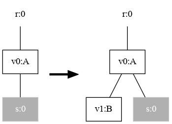
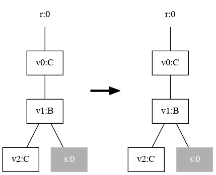
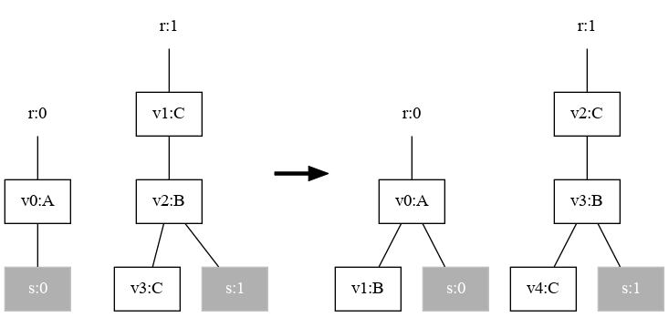

Very much like [Signature Operations](../basic/signatureops), reaction rules can be composed as well.

There are several variants for combining rules, each determined by the specific operator employed:
- Composition and nesting
- Tensor product and parallel product
- Merge product

Nesting and parallel product are analogous to composition and tensor product, respectively, but involve name sharing.

:::caution
Currently, only the parallel product is implemented.
:::

## Composing Rules in Parallel

### Create Reaction Rules

Three methods are defined that create the signature, and the two rules named A and B.
The rules are also displayed below for reference.
```java
private DefaultDynamicSignature sig() {
    DynamicSignatureBuilder defaultBuilder = pureSignatureBuilder();
    defaultBuilder
            .addControl("A", 1)
            .addControl("B", 1)
            .addControl("C", 1)
            .addControl("D", 1)
    ;
    return defaultBuilder.create();
}

private ReactionRule<PureBigraph> createRR_A() throws InvalidReactionRuleException {
    DefaultDynamicSignature sig = sig();
    PureBigraphBuilder<DefaultDynamicSignature> bRedex = pureBuilder(sig);
    PureBigraphBuilder<DefaultDynamicSignature> bReactum = pureBuilder(sig);

    bRedex.createRoot()
            .addChild("A").down()
            /**/.addSite().top()
    ;
    bReactum.createRoot()
            .addChild("A").down()
            /**/.addSite()
            /**/.addChild("B")
    ;
    PureBigraph redex = bRedex.createBigraph();
    PureBigraph reactum = bReactum.createBigraph();
    ParametricReactionRule<PureBigraph> rr = new ParametricReactionRule<>(redex, reactum);
    rr.withLabel("RA");
    TrackingMap map = new TrackingMap();
    map.put("v0", "v0");
    map.put("v1", "");
    rr.withTrackingMap(map);
    InstantiationMap iMap = InstantiationMap.create(1);
    iMap.map(0, 0);
    rr.withInstantiationMap(iMap);
    return rr;
}

private ReactionRule<PureBigraph> createRR_B() throws InvalidReactionRuleException {
    DefaultDynamicSignature sig = sig();
    PureBigraphBuilder<DefaultDynamicSignature> bRedex = pureBuilder(sig);
    PureBigraphBuilder<DefaultDynamicSignature> bReactum = pureBuilder(sig);

    bRedex.createRoot()
            .addChild("C").down()
            /**/.addChild("B").down()
            /**//**/.addSite().addChild("C")
    ;

    bReactum.createRoot()
            .addChild("C").down()
            /**/.addChild("B").down()
            /**//**/.addSite().addChild("C")
    ;

    PureBigraph redex = bRedex.createBigraph();
    PureBigraph reactum = bReactum.createBigraph();
    ParametricReactionRule<PureBigraph> rr = new ParametricReactionRule<>(redex, reactum);
    rr.withLabel("RB");
    TrackingMap map = new TrackingMap();
    map.put("v0", "v0");
    map.put("v1", "v1");
    map.put("v2", "v2");
    rr.withTrackingMap(map);
    InstantiationMap iMap = InstantiationMap.create(1);
    iMap.map(0, 0);
    rr.withInstantiationMap(iMap);
    return rr;
}
```

:::note
Both rules have also an instantiation map and a tracking map assigned.
:::

|Rule A | Rule B |
|---|---|
|||

### Calling the Rule Composer

After having defined the two rules, we can call the `ReactionRuleComposer` class:
```java
ReactionRule<PureBigraph> rrA = createRR_A();
ReactionRule<PureBigraph> rrB = createRR_B();
ReactionRuleComposer<ParametricReactionRule<Bigraph<?>>> rComp = new ReactionRuleComposer<>();
ParametricReactionRule<Bigraph<?>> product = rComp.parallelProduct(rrA, rrB);
```

The result is shown below.



Note that the instantiation map and tracking map has changed as well:

```java
System.out.println("Product label = " + product.getLabel());
assert product.getLabel().equals("RA_PP_RB");
System.out.println(product.getTrackingMap());
product.getInstantationMap().getMappings().forEach((k,v) -> {
    System.out.println(k.getValue() + " -> " + v.getValue());
});
```
**Output**
```text
Product label = RA_PP_RB
{v0=v0, v1=, v2=v1, v3=v2, v4=v3}
1 -> 1
0 -> 0
```

:::tip
The default string separator "\_PP\_" combines the two rule labels to form a new rule label.
This separator string can be changed by calling `ReactionRuleComposer#withSeparator(String)`.
:::