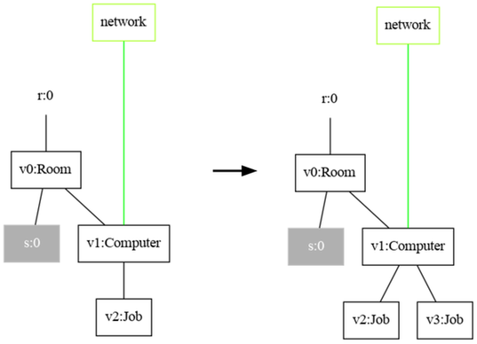
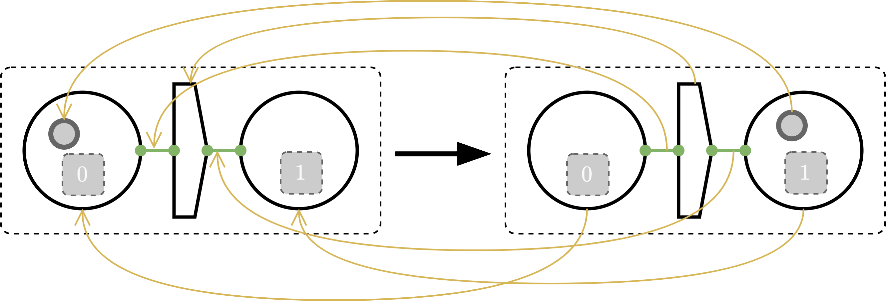

This section explains how to create reaction rules.
Reaction rules define the behavior of a bigraphical reactive system (BRS) specification and are defined over the same signature as the system model (i.e., the initial bigraph state or configuration).

Important generic interface: `org.bigraphs.framework.core.reactivesystem.ReactionRule<B extends Bigraph<? extends Signature<?>>>`.

There are different types of rules:
- ground rules, parametric rules, conditional rules, probabilistic rules, tracking rules, ...

To put simply, a ground rule has no sites (i.e., placeholders), whereas a parametric reaction rules includes them.
Sites are used to abstract elements of the system's environment away and allow to specify only the parts of the environment of interest.
The properties and usage of the rules are explain in the following.

## General Format of a Reaction Rule

A reaction rule in bigraphs is defined as a tuple , where _L_/_R_ is the left-/right-hand side of the rule,  the instantiation map, and  the _tracking map_.

Moreover, a parametric reaction rule is simple if it is (see [\[1\]](#references)):
- inner-injective: no two sites are siblings
- open: every link is open
- guarding: no site has a root as parent

Bigraph Framework implements simple parametric reaction rules.
These conditions are automatically checked.
If a rule does not conform to these conditions an exception is thrown.

## Parametric Reaction Rules

A _parametric reaction_ rule contains _sites_, which are placeholders that abstract away parts of the environment.
If the rule does not contain _sites_, it is called a _ground rule_.
The bigraph theory states that all ground rules can be built from parametric rules.

### Usage Example

The following example shows how to create a parametric reaction rule:

```java
DefaultDynamicSignature signature = pureSignatureBuilder()
        .addControl("Room", 0)
        .addControl("Computer", 1)
        .addControl("Job", 0)
        .create()
        ;
// Redex builder
PureBigraphBuilder<DefaultDynamicSignature> builder = pureBuilder(signature);
// Reactum builder
PureBigraphBuilder<DefaultDynamicSignature> builder2 = pureBuilder(signature);
// Connect computer over the same channel link
BigraphEntity.OuterName network = builder.createOuterName("network");
builder.createRoot()
        .addChild("Room")
        .down()
        .addSite()
        .addChild("Computer").linkToOuter(network)
        .down()
        .addChild("Job")
;
builder2.createRoot()
        .addChild("Room")
        .down()
        .addSite()
        .addChild("Computer").linkToOuter("network") // or just specify the string
        .down()
        .addChild("Job").addChild("Job")
;

// builder.makeGround(); // useful for instances of type GroundReactionRule
// builder2.makeGround(); // useful for instances of type GroundReactionRule
PureBigraph redex = builder.createBigraph();
PureBigraph reactum = builder2.createBigraph();
ReactionRule<PureBigraph> rr = new ParametricReactionRule<>(redex, reactum);
BigraphGraphvizExporter.toPNG(rr.getRedex(), true, new File("redex.png"));
BigraphGraphvizExporter.toPNG(rr.getReactum(), true, new File("reactum.png"));
```

The rule visualized:



*The rule adds another `Job` to the `Computer` only if there is already one `Job`. The contents below `Room` are preserved after the reaction, which is indicated by the same site index under `Room`.*

### Instantiation Maps

Sites of a _parametric rule_ are indexed.
After a reaction, the contents under the site (also called _parameters_ in bigraph-jargon) get copied to the site of the reactum with the same index.
This is clear when the number of sites in the redex and reactum are equal.
In other cases, one can decided what shall happen with the parameters after the reaction in the new state.
Therefore, the instantiation map  of a reaction rule provides greater control over what happens to the parameters of the bigraph match.

The instantiation map can be supplied to the constructor of implementations of:
- [`org.bigraphs.framework.core.reactivesystem.AbstractReactionRule`](https://bigraphs.org/products/bigraph-framework/apidocs/org/bigraphs/framework/core/reactivesystem/AbstractReactionRule.html)

It can be created using the factory method:
- `InstantiationMap.create(int n)`, where `n` is the number of possible elements in the map
- Use `InstantiationMap#map(int from, int to)` to map the site index `from` to the site index `to` (from the reactum to the redex)

## Conditional Reaction Rules

Rules provide expressive means to define pre-conditions so that a rule can actually be fired.
Additionally, the post-conditions, i.e., the result is easily specified using the right-hand side of the rule (i.e., the redex).
This can be done using the redex only, or via so-called Conditional Rules ([`org.bigraphs.framework.core.reactivesystem.ConditionalParametricRuleDecorator`](https://bigraphs.org/products/bigraph-framework/apidocs/org/bigraphs/framework/core/reactivesystem/ConditionalParametricRuleDecorator.html)).

A conditional rule can als evaluate [attributes](../advanced/attributed-bigraphs) in the course of a reaction, which allows also to include external, global data.


## Tracking Rules

Reaction rules with tracking maps  allow for causal reasoning over time when a bigraph evolves.
This is then possible because the identities of the nodes can be traced through reactions as they can be _preserved_ by means of this map.
Normally, the identities get lost during the rewrite operation since the bigraph theory implements a compositional approach of graph rewriting.
This map allows to reason about whether entities splitted, merged, got removed or added.

A tracking map is defined for a specific reaction rule.
This map relates nodes of the reactum to nodes of the redex.
The image of this map can also be the empty set.


*A reaction rule with a tracking map.*

### Usage Example

The responsible class `org.bigraphs.framework.core.reactivesystem.TrackingMap` is a standard Java `HashMap<String, String>` implementation.

```
// map: reactum -> redex
TrackingMap map = new TrackingMap();
map.put("v0", "v2");
map.put("v1", "v1");
map.put("v2", "v0");
map.put("v3", "v3");
PureBigraph redex = ...;
PureBigraph reactum = ...;
ParametricReactionRule<PureBigraph> rr = new ParametricReactionRule<>(redex, reactum);
rr.withTrackingMap(map);
```

:::tip Help with the node IDs
To get the node IDs right, it is recommended to export a graphic of the redex and reactum of the rule first and lay them side-by-side on the screen.
See, for example, [Exporting Bigraphs as Images](../visualization/visualization-intro) on how to export a bigraph as PNG using the DOT format.
:::

## Bounded Reaction Rules

A reaction rule can be _bound_ to an existing reactive system specification.
Therefore, the method `org.bigraphs.framework.core.reactivesystem.AbstractReactionRule#withReactiveSystem(ReactiveSystem<B>)` is available.
A new class `ReactiveSystemBoundReactionRule<B>` is returned which extends `AbstractReactionRule` and contains the previously create reaction rule as well as the reactive system.

This helps to organize reaction rules and give them a strong semantic affiliation to a reactive system.

Note that this feature does not add a reaction rule to that reactive system automatically.
As a consequence, the `org.bigraphs.framework.core.reactivesystem.AbstractSimpleReactiveSystem#addReactionRule(ReactionRule<B>)` method has to be used.

## References

- \[1\] Milner, Robin: The Space and Motion of Communicating Agents. 1st. Aufl. New York, NY, USA : Cambridge University Press, 2009 — ISBN 978-0-521-73833-0
