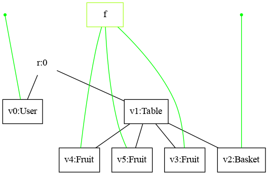
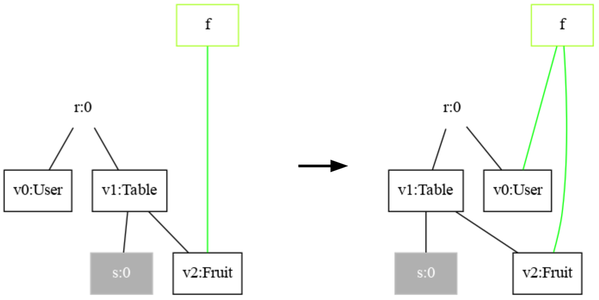
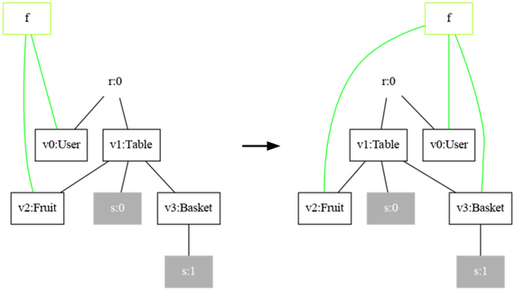
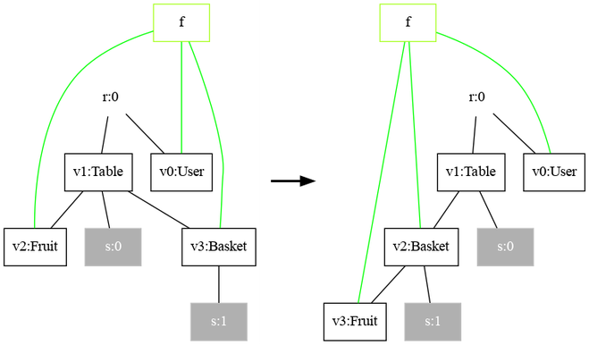
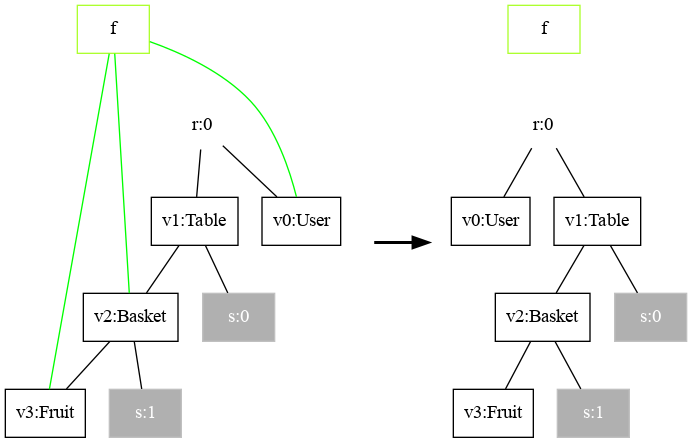
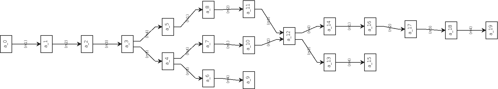

This guide provides a complete walkthrough on how to simulate bigraphical reactive systems (BRS).
The following aspects are covered:
- Specification of the signature
- Specification of the initial state
- Specification of the reaction rules

This is done using a running example.

## Scenario Description
The running example describes a "system", where a user can put a fruit into a basket.
The environment of this "system" comprises a `Table`, a `Basket`, some generic `Fruit` entities and a `User`.
Only one high-level action exists, namely, picking a fruit and placing it into the available `Basket`.
This simple system description might sound simple but when more users and baskets are introduced the problem becomes more challenging to manage.
This type of problem involves concurrent behavior and dynamic allocation and arises from a category of complex problems in the field of computer science that are generally hard to solve.


In the following, we are going to translate this scenario description into a BRS-based specification and simulate its behavior.
That allows us to observe the overall behavior of the system and also take snapshots of the states over time.

## The Signature

```java
import org.bigraphs.framework.core.*;
import org.bigraphs.framework.core.impl.pure.*;
import org.bigraphs.framework.core.impl.signature.*;

import static org.bigraphs.framework.core.factory.BigraphFactory.*;

public static DynamicSignature createSignature() {
    DynamicSignatureBuilder defaultBuilder = pureSignatureBuilder();
    defaultBuilder
        .add("User", 1, ControlStatus.ATOMIC)
        .add("Basket", 1)
        .add("Fruit", 1, ControlStatus.ATOMIC)
        .add("Table", 0)
    ;
    return defaultBuilder.create();
}
```

Because the `User`, `Basket` and `Fruit` entities will have to synchronize during the pick and place task, they all have arity 1.
That is, they can connect to a _link_ (also called _channel_) to indicate a synchronisation action on distributed locations.
The property `ATOMIC` indicates that this entities cannot contain any children.

## The Initial State of the System



*The `User` and `Basket` are not connected to any link. Their ports are idle.*

:::tip
Bigraphs can be exported using the Visualization Module of Bigraph Framework.
See, for example, [Exporting Bigraphs as Images](../visualization/visualization-intro) on how to export a bigraph as PNG using the DOT format.
:::

```java
import org.bigraphs.framework.core.*;
import org.bigraphs.framework.core.impl.pure.*;
import org.bigraphs.framework.core.impl.signature.*;
import org.bigraphs.framework.core.exceptions.*;

import static org.bigraphs.framework.core.factory.BigraphFactory.*;

public static PureBigraph createAgent() throws InvalidConnectionException {
    return pureBuilder(createSignature()).root()
        .child("User")
        .child("Table").down()
        .child("Basket")
        .child("Fruit", "f")
        .child("Fruit", "f")
        .child("Fruit", "f")
        .create();
}
```

## Reaction Rules

The high-level pick and place action of our system under consideration has to be decomposed into four smaller "interlocking" steps.

Each step ensures that the entire action can actually be executed.
This is done by acquiring a connection first to the `Fruit` entities (if one is available), and afterward also to the `Basket` entity as long as nothing is connected to it.
This can also be thought as a "locking" mechanism to handle concurrency.
The last rule finally transfers a `Fruit` entity to the `Basket` entity.
Since all `Fruit`s share the same link _f_, any fruit will be picked as long one is available.
It can be thought of an m:1 queue (input size _m_, output size 1).
The role of the `User` in this system is to provide an indication of who has performed the action.
The fruit transfer rule could have been written also without the user.
The last rule simply releases all "locks" so that the procedure can be repeated with any other `User` and `Fruit` in the system.

:::note
The amount of details of a specification is domain-specific and depends on the specific use case.
:::

### Reaction Rule 1: Lock the Fruit

A "lock" is acquired on any `Fruit` on the `Table` by a "free" `User`:

```java
import org.bigraphs.framework.core.impl.pure.*;
import org.bigraphs.framework.core.impl.signature.*;
import org.bigraphs.framework.core.reactivesystem.*;
import org.bigraphs.framework.core.exceptions.*;

import static org.bigraphs.framework.core.factory.BigraphFactory.*;

public static ParametricReactionRule<PureBigraph> createRR1() throws InvalidReactionRuleException, InvalidConnectionException {
    PureBigraphBuilder<DynamicSignature> b1 = pureBuilder(createSignature());
    PureBigraphBuilder<DynamicSignature> b2 = pureBuilder(createSignature());
    b1.root()
        .child("User")
        .child("Table").down()
        .child("Fruit", "f").site()
    ;
    b2.root()
        .child("User", "f")
        .child("Table").down()
        .child("Fruit", "f").site()
    ;
    PureBigraph redex = b1.create();
    PureBigraph reactum = b2.create();
    ParametricReactionRule<PureBigraph> rr = new ParametricReactionRule<>(redex, reactum).withLabel("rr1");
    return rr;
}
```



*A `User` is "free" as long as its single _port_ is not connected to any open link. The right-hand side assigns a `Fruit` to a `User`.*

### Reaction Rule 2: Lock the Basket

A "lock" is acquired on the `Basket` if a `User` has already ensured to receive a `Fruit`:

```java
import org.bigraphs.framework.core.impl.pure.*;
import org.bigraphs.framework.core.impl.signature.*;
import org.bigraphs.framework.core.reactivesystem.*;
import org.bigraphs.framework.core.exceptions.*;

import static org.bigraphs.framework.core.factory.BigraphFactory.*;

public static ParametricReactionRule<PureBigraph> createRR2() throws InvalidReactionRuleException, InvalidConnectionException {
    PureBigraphBuilder<DynamicSignature> b1 = pureBuilder(createSignature());
    PureBigraphBuilder<DynamicSignature> b2 = pureBuilder(createSignature());
    b1.root()
        .child("User", "f")
        .child("Table").down()
        .child("Fruit", "f").site()
        .child("Basket").down().site()
    ;
    b2.root()
        .child("User", "f")
        .child("Table").down()
        .child("Fruit", "f").site()
        .child("Basket", "f").down().site()
    ;
    PureBigraph redex = b1.create();
    PureBigraph reactum = b2.create();
    ParametricReactionRule<PureBigraph> rr = new ParametricReactionRule<>(redex, reactum).withLabel("rr2");
    return rr;
}
```



*If this rule matches the setup is complete.*

### Reaction Rule 3: Transfer the Fruit

The following rule describes the actual pick and place task of the system.
A `Fruit` on the `Table` is transferred to the `Basket` of the `Table`:

```java
import org.bigraphs.framework.core.impl.pure.*;
import org.bigraphs.framework.core.impl.signature.*;
import org.bigraphs.framework.core.reactivesystem.*;
import org.bigraphs.framework.core.exceptions.*;

import static org.bigraphs.framework.core.factory.BigraphFactory.*;

public static ParametricReactionRule<PureBigraph> createRR3() throws InvalidReactionRuleException, InvalidConnectionException {
    PureBigraphBuilder<DynamicSignature> b1 = pureBuilder(createSignature());
    PureBigraphBuilder<DynamicSignature> b2 = pureBuilder(createSignature());
    b1.root()
        .child("User", "f")
        .child("Table").down()
        .child("Fruit", "f").site()
        .child("Basket", "f").down().site()
    ;
    b2.root()
        .child("User", "f")
        .child("Table").down()
        .site()
        .child("Basket", "f").down().child("Fruit", "f").site()
    ;
    PureBigraph redex = b1.create();
    PureBigraph reactum = b2.create();
    ParametricReactionRule<PureBigraph> rr = new ParametricReactionRule<>(redex, reactum).withLabel("rr3");
    return rr;
}
```



*The `Fruit` is transferred from the `Table` to the `Basket` still keeping the reference.*

### Reaction Rule 4: Release Locks

The transferred `Fruit` looses the reference to the other `Fruit`s on the `Table`.
Specifically, it is not connected anymore to the link named _f_.
Also, the `User` and `Basket` are now "free" to connect again after the rule was fired.

```java
import org.bigraphs.framework.core.impl.pure.*;
import org.bigraphs.framework.core.impl.signature.*;
import org.bigraphs.framework.core.reactivesystem.*;
import org.bigraphs.framework.core.exceptions.*;

import static org.bigraphs.framework.core.factory.BigraphFactory.*;

public static ParametricReactionRule<PureBigraph> createRR4() throws InvalidReactionRuleException, InvalidConnectionException {
    PureBigraphBuilder<DynamicSignature> b1 = pureBuilder(createSignature());
    PureBigraphBuilder<DynamicSignature> b2 = pureBuilder(createSignature());
    b1.root()
        .child("User", "f")
        .child("Table").down().site()
        .child("Basket", "f").down().child("Fruit", "f").site()
    ;
    b2.createOuter("f");
    b2.root()
        .child("User")
        .child("Table").down().site()
        .child("Basket").down().child("Fruit").site()
    ;
    PureBigraph redex = b1.create();
    PureBigraph reactum = b2.create();
    ParametricReactionRule<PureBigraph> rr = new ParametricReactionRule<>(redex, reactum).withLabel("rr4");
    return rr;
}
```

:::info Interfaces of Reaction Rules
It is important to note that the redex and reactum of a rule are required to have the same outer faces.
Thus, the idle outer name _f_ is still needed in the reactum.
(Their inner face, i.e., sites, can be different.)
:::



*Release all "locks".*

## Bigraphical Reactive System Specification

The agent and the rules are collected to form a reactive system:

### Declaration

```java
import org.bigraphs.framework.core.reactivesystem.*;
import org.bigraphs.framework.simulation.matching.pure.*;

PureReactiveSystem rs = new PureReactiveSystem();
rs.setAgent(createAgent());
rs.addReactionRule(createRR1());
rs.addReactionRule(createRR2());
rs.addReactionRule(createRR3());
rs.addReactionRule(createRR4());
assert rs.isSimple();
```

### Execution via Model Checking
This specification can be executed by the model checker class [`org.bigraphs.framework.simulation.modelchecking.PureBigraphModelChecker`](https://bigraphs.org/software/bigraph-framework/apidocs/org/bigraphs/framework/simulation/modelchecking/PureBigraphModelChecker.html), which basically performs an exhaustive breadth-first search on the initial state.
Correctness properties via [bigraphical predicates](simulation-predicates) can simply be omitted.

:::info BRS Model Checking
Refer to [Verification](verification-intro) to get to know more about how to use a BRS specification for model checking.
:::

```java
import org.bigraphs.framework.simulation.modelchecking.*;

ModelCheckingOptions opts = ModelCheckingOptions.create();
opts
        .and(transitionOpts()
            .setMaximumTransitions(100)
            .setMaximumTime(60)
            .create()
        )
        .and(ModelCheckingOptions.exportOpts()
            .setReactionGraphFile(new File("transition_graph.png"))
            .setPrintCanonicalStateLabel(false)
            .setOutputStatesFolder(new File("states/"))
            .create()
        )
;

PureBigraphModelChecker modelChecker = new PureBigraphModelChecker(
        rs,
        BigraphModelChecker.SimulationStrategy.Type.BFS,
        opts);
modelChecker.execute();
```

#### Termination

:::info
The model checking procedure automatically finishes when the system's behavior is finite, or the overall system's behavior is a cycle.
:::

:::note Convergence Criteria
Note that the model checking process may not terminate if the system has infinite behavior.
Therefore, it is advised to set constraints such as the maximum allowed duration or maximum number of transitions to explore.
:::


#### Debugging the Transition System

The output path of the transition system can be specified in the model checking options object (see above).
The transition system is a PNG graphic file and shows all possible states and actions for visual exploration and debugging:



*The system has three final states and five solutions. Each final state is the same: All `Fruit`s are in the `Basket`. However, how to reach this solution is different as can be seen by the different paths. The shortest path provides a solution where all `Fruit`s are placed into the `Basket` one-by-one without calling the release action in-between but only once before the final state. This solution is, however, *unfair* if multiple `User`s are involved.*

#### Reaction Graph Object
Another way is by using the reaction graph instance of type `ReactionGraph` of the model checker object:
```java
import org.bigraphs.framework.core.impl.pure.*;
import org.bigraphs.framework.core.reactivesystem.*;

ReactionGraph<PureBigraph> reactionGraph = modelChecker.getReactionGraph();
```

The class `ReactionGraph` inherits from `AbstractTransitionSystem` and implements the standard methods for transition systems.
The concrete implementation, however, defines the actual data structure of the transition system.
Internally, the reaction graph manages an instance of `org.jgrapht.Graph` with `LabeledNode` as states and `LabeledEdge` as transition relations.
It is a simple directed graph (allowing multiple edges, allowing self loops).
Both the `LabeledNode` and `LabeledEdge` class provide getter-methods that return string labels, which denote the name of the bigraph state and rule, respectively, added to the reactive system container.

### Programmatic Execution

By acquiring a bigraph matcher instance, arbitrary rule execution logic can be implemented:
```java
import org.bigraphs.framework.core.impl.pure.*;
import org.bigraphs.framework.core.reactivesystem.*;
import org.bigraphs.framework.simulation.matching.*;

ParametricReactionRule<PureBigraph> rr11 = createRR1();
AbstractBigraphMatcher<PureBigraph> matcher = AbstractBigraphMatcher.create(PureBigraph.class);
MatchIterable<BigraphMatch<PureBigraph>> match = matcher.match(agent, rr11);
Iterator<BigraphMatch<PureBigraph>> iterator = match.iterator();
while (iterator.hasNext()) {
    BigraphMatch<PureBigraph> next = iterator.next();
    PureBigraph result = rs.buildParametricReaction(agent, next, rr11);
    // do something with `result`
}
```

The rewrite functionality is provided by the concrete `org.bigraphs.framework.core.reactivesystem.ReactiveSystem` instance.