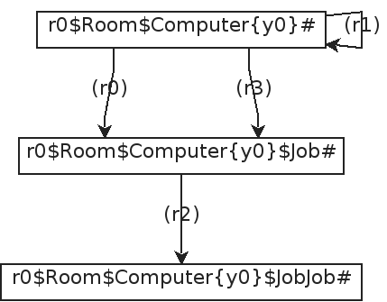
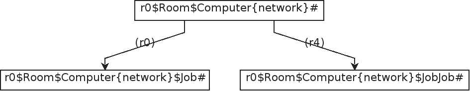
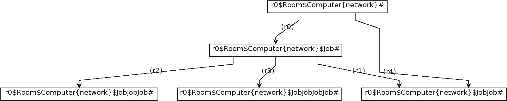

In software engineering,
*formal verification* is a technique
for ensuring the correctness of programs using mathematical models and methods.
Unlike traditional testing approaches,
formal verification provides rigorous guarantees about a program's behavior
by proving specific properties against a formal specification.

In this process,
a program (formulated as bigraphical reactive system) is checked against a set of correctness properties.
A program is considered correct if its implementation conforms to the given specification.
This method is particularly valuable for developing safe and reliable software,
as it can identify errors that might be missed by conventional techniques like unit testing.

One widely used formal verification method is called *model checking*,
which systematically explores all possible states of a system to verify whether certain properties hold.
This approach is integrated into the simulation module of **Bigraph Framework**.

Specifically, a directed model-checking technique is employed.
Refer to [\[1\]](#ref1), [\[2\]](#ref2), [\[3\]](#ref3).

[//]: # (<!-- For model checking, we the following dependencies are used: -->)

[//]: # (<!-- - tweety, JDD, JavaDD -->)

## Creating a Model Checker

<!-- Two processes mutually requesting a exclusive resource. -->
<!-- Then, we want to verify that both processes never enter their critical section at the same time. -->
This code example shows how to create a model checker object for pure bigraphs:

```java
// Create a pure reactive system container
PureReactiveSystem reactiveSystem = new PureReactiveSystem();

// Add an agent (the initial state) and reaction rules (logic)
/* code omitted */

// Create model checking options
ModelCheckingOptions opts = ModelCheckingOptions.create();

// Create the pure bigraph model checker
PureBigraphModelChecker modelChecker = new PureBigraphModelChecker(
        reactiveSystem,
        BigraphModelChecker.SimulationStrategy.Type.BFS,
        opts
);
modelChecker.execute();
```

Some remarks:
- The `execute()` method may throw a `BigraphSimulationException`
- Simulation types are covered [here](#simulation-types).
- Model checking options are explained [here](#model-checking-options).

### Reachability Checking

The model checking procedure implemented in Bigraph Framework is especially suited for so-called _reachability checking_.

This topic is covered in [Bigraphical Predicates](simulation-predicates).

## Simulation types

The frameworks builds the reaction graph in the course of the simulation.
Only the canonical form of an agent is stored in the graph to reduce the
number of admissable states in order to minimize the state-space explosion problem.

### Breadth-first Simulation

The algorithm described in [\[1\]](#ref1) is implemented.

The respective reaction graph of the above example is shown below after
the BFS simulation finished.



This form of simulation provides no guarantee that the simulation will end at some point.

### Random Simulation

This type of simulation starts to apply a set of given reaction rules
on an initial agent. After the reaction graph is expanded, the simulation
randomly selects a new state and repeats the process.
In other words, it follows only on path at random until now further rules can be applied.
This form of simulation provides no guarantee that the simulation will end at some point or that the simulation will eventually reach a desired state.

|Random Run #1 | Random Run #2 |
|---|---|
|||

Regarding the first random run of our example (left-hand figure above), rules (r0) and (r4) were applied on the agent. The algorithm
was selecting the second agent (the one where (r4) points to), however, also
stops here, since no further rules could be applied.

If the agent were chosen (where (r0) points to), rules (r1), (r2) and (r3) could be applied.
This case is illustrated in the right-hand figure above.

## Model Checking Options

Model checking options may be provided to the model checker.
Therefore, the class `ModelCheckingOptions` needs to be created. An
example is shown below.

```java
ModelCheckingOptions opts = ModelCheckingOptions.create();
opts
        .doMeasureTime(true) // for debugging
        .setReactionGraphWithCycles(true)
        .and(transitionOpts()
                .setMaximumTransitions(100) // maximum transition count
                .setMaximumTime(100) // in seconds
                .allowReducibleClasses(true) // default: true
                .rewriteOpenLinks(false) // default: false
                .create()
        )
        .and(ModelCheckingOptions.exportOpts()
                .setReactionGraphFile(Paths.get("transition_graph.png").toFile())
                .setPrintCanonicalStateLabel(false)
                .setOutputStatesFolder(Paths.get("states/").toFile())
                .setFormatsEnabled( // output formats of states
                        List.of(
                                ModelCheckingOptions.ExportOptions.Format.PNG,
                                ModelCheckingOptions.ExportOptions.Format.XMI
                        )
                )
                .create()
        )
;
```

The individual options are divided into several categories which can be accessed by
their respective builder classes.
Currently, the following categories are available:

- `ModelCheckingOptions.TransitionOptions`
- `ModelCheckingOptions.ExportOptions`

They are explained in the following.

### Transition-related Options

#### Stopping Criteria
Notice that `ModelCheckingOptions.TransitionOptions` let us specify some stopping criteria by
acquiring its builder by calling `ModelCheckingOptions.TransitionOptions.transitionOpts()`:

- Maximal Number of transitions to allow
- Time
- ...

The following methods are available through the `ModelCheckingOptions.transitionOpts()` builder instance to adjust the [canonical string encoding algorithm of bigraphs](https://link.springer.com/article/10.1007/s42979-021-00552-5), which is used for cycle checking of the transition system:
- `TransitionOptions.Builder#allowReducibleClasses(bool)`
- `TransitionOptions.Builder#rewriteOpenLinks(bool)`

The default values are good for most of the cases.

### Output-related options

The `ModelCheckingOptions.ExportOptions` class allows specifying a file path where the reaction graph (i.e., transition system)
and the individual states shall be written to.
If these options are left empty then the graphs are not exported.
Also, one can decide if the state labels of the reaction graph are simple identifiers _a<sub>1</sub>_, _a<sub>2</sub>_, _a<sub>3</sub>_, ... or [canonical string encodings of bigraphs](https://link.springer.com/article/10.1007/s42979-021-00552-5).
Note that these canonical labels can be quite long for large states.

## Event Listeners

One may listen to specific events that are thrown during the simulation. This gives the user the possibility to interact
with the simulation and fire additional actions or to log these events and evaluate them later, additionally to the
final built reaction graph.

Therefore, the interface `ReactiveSystemListener<B extends Bigraph<? extends Signature<?>>>` must be implemented and added
to a model checker instance. It provides methods to listen when a reaction rule is applied or when the verification process finished, for instance.

For example, see [here](simulation-predicates#listen-to-predicate-evaluation) on how to listen for predicate evaluation results.


## Asynchronous Execution

To perform the model checking asynchronously, call the `BigraphModelChecker#executeAsync()`:

```java
Future<ReactionGraph<PureBigraph>> reactionGraphFuture = modelChecker.executeAsync();
ReactionGraph<PureBigraph> pureBigraphReactionGraph = reactionGraphFuture.get();
```

The `executeAsync()` method does not block the execution and returns a `Future` object to fetch the result later.
It contains the complete reaction graph of the simulated BRS.

One can then export the transition system by calling  `modelChecker.exportReactionGraph(pureBigraphReactionGraph)`.

### Custom Executor Service

The `java.util.concurrent.ExecutorService` is used to submit tasks of the model checker.

Bigraph framework offers to provide a custom `ExecutorService` by implementing the interface
`org.bigraphs.framework.core.providers.ExecutorServicePoolProvider`, found in the `bigraph-core` dependency.
The class `BigraphModelChecker` uses the `java.util.ServiceLoader` (see [https://docs.oracle.com/javase/tutorial/ext/basics/spi.html#the-serviceloader-class](https://docs.oracle.com/javase/tutorial/ext/basics/spi.html#the-serviceloader-class)
to search for an implementation.

A default _executor service provider_ is provided within the `bigraph-simulation` module,
which creates a fixed thread pool.

Therefore,
refer to [`org.bigraphs.framework.simulation.modelchecking.FixedThreadPoolExecutorProvider`](https://bigraphs.org/products/bigraph-framework/apidocs/org/bigraphs/framework/simulation/modelchecking/FixedThreadPoolExecutorProvider.html).


## References

- \[1\] <a id="ref1" href="https://dl.acm.org/citation.cfm?doid=357172.357178">S. Owicki and L. Lamport, "Proving Liveness Properties of Concurrent Programs," ACM Trans. Program. Lang. Syst., vol. 4, no. 3, pp. 455–495, Jul. 1982.</a>

- \[2\] <a id="ref2" href="https://pure.itu.dk/portal/files/39500908/thesis_GianDavidPerrone.pdf">G. Perrone, “Domain-Specific Modelling Languages in Bigraphs,” IT University of Copenhagen, 2013.</a>

- \[3\] <a id="ref3"></a>Clarke, E. M. ; Henzinger, T. A. ; Veith, H. ; Bloem, R. (Hrsg.): Handbook of Model Checking : Springer International Publishing, 2018 — ISBN 978-3-319-10574-1


