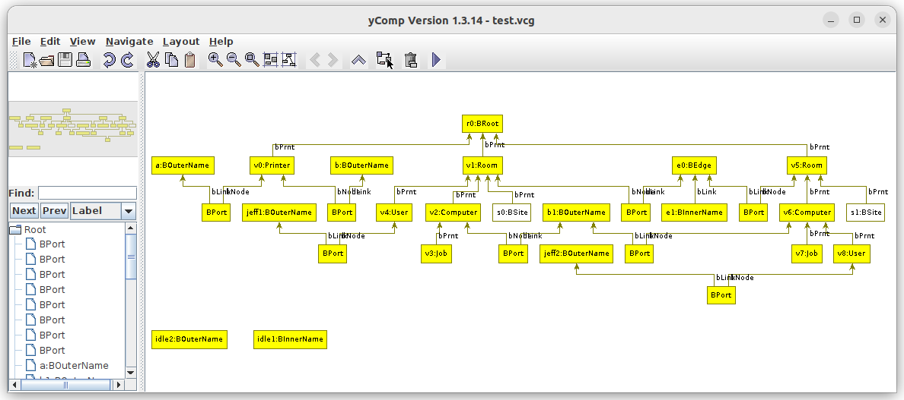

Bigraphs can be visualized by converting it first into the Visualization of Compiler Graphs (VCG) format.
Afterward, the VCG file can be visualized using [yComp](https://pp.ipd.kit.edu/firm/yComp.html).



yComp is a Java-based visualization tool that reads and renders graphs in the VCG format and supports several layouts.

## Usage Example

To visualize a bigraph in that way, the bigraph has to be converted to the VCG format first:
```java
PureBigraph bigraph = createBigraph();
VCGTransformator vcgExport = new VCGTransformator();
FileOutputStream fout = new FileOutputStream("graph-output.vcg");
vcgExport.toOutputStream(bigraph, fout);
fout.close();
```

Then, the resulting file `graph-output.vcg` can be loaded and visualized by yComp.
Therefore, execute the following command:
```shell
ycomp graph-output.vcg
```

yComp can be acquired [here](https://pp.ipd.kit.edu/firm/yComp.html) and is also shipped with [GrGen.NET](https://grgen.de/).

[//]: # (See [here]&#40;&#41; for more information on that.)