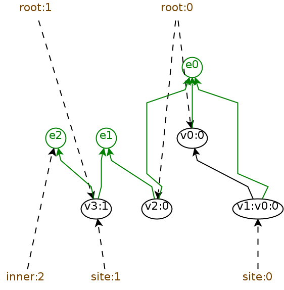

The framework provides simple means to graphically display bigraphs and
export them as `*.svg` or `*.png`.

Internally, the [graphviz-java](https://github.com/nidi3/graphviz-java) library is used. Bigraphs are constructed as
graphviz models and afterwards converted as graphic file. This allows to export the corresponding DOT file at any time.

## Exporting Pure Bigraphs
### Export as PNG File

```java
PureBigraph bigraph = ...;
String convert = BigraphGraphvizExporter.toPNG(bigraph,
        true,
        new File("bigraph-exported.png")
);
```

The return value outputs the bigraph in the DOT format.

The second parameter allows to export the bigraph as a tree-format (flag must be set to `true`) or in the containment-format (flag must be set to `false`).
The difference is shown below.

|As Tree | As Containment |
|---|---|
|  |   |

### Export as DOT File

Same as above but without exporting the bigraph to the filesystem:

```java
PureBigraph bigraph = ...;
String converted = BigraphGraphvizExporter.toDOT(bigraph, true);
```

The value of `converted` is:

```
graph "Bigraph" {
 graph ["rankdir"="BT"]
 "Job_v4" ["color"="black","shape"="rectangle"]
 "Computer_v2" ["color"="black","shape"="rectangle"]
 "Room_v0" ["color"="black","shape"="rectangle"]
 "r_0" ["fontcolor"="black","style"="setlinewidth(1)","shape"="ellipse"]
 "User_v1" ["color"="black","shape"="rectangle"]
 "Job_v3" ["color"="black","shape"="rectangle"]
 {
 graph ["rank"="same"]
 "r_0"
 }
 {
 graph ["rank"="same"]
 "Room_v0"
 }
 {
 graph ["rank"="same"]
 "User_v1"
 "Computer_v2"
 }
 {
 graph ["rank"="same"]
 "Job_v4"
 "Job_v3"
 }
 {
 graph ["rank"="source"]
 }
 {
 graph ["rank"="sink"]
 }
 "Job_v4" -- "Computer_v2" ["label"=""]
 "Computer_v2" -- "Room_v0" ["label"=""]
 "Room_v0" -- "r_0" ["label"=""]
 "User_v1" -- "Room_v0" ["label"=""]
 "Job_v3" -- "Computer_v2" ["label"=""]
 }
 ```

 ## Visualizing Ranked Graphs

 As described in [Section "Ranked Graphs"](../converter/rankedgraphs-converter), a bigraph can be casted to a ranked graph.
 The visualization module also provides support to export a ranked graphs as a diagram as follows:

```java
PureBigraph bigraph = ...;
PureBigraphRankedGraphEncoding graphEncoding = new PureBigraphRankedGraphEncoding(bigraph);
new BigraphRankedGraphExporter().toPNG(graphEncoding, new File("ranked-graph.png"));
```

An example is shown below.


