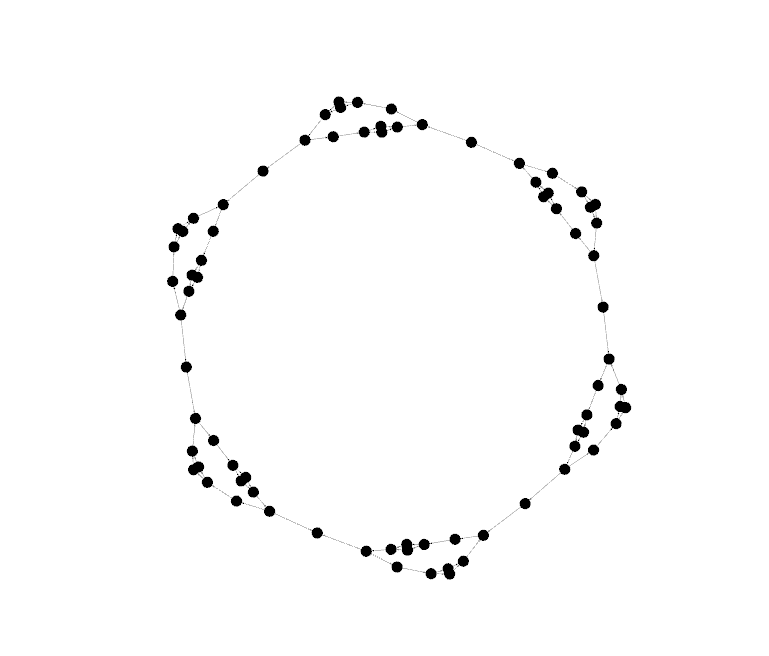
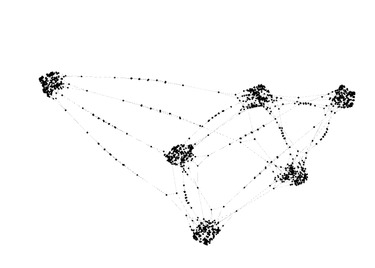
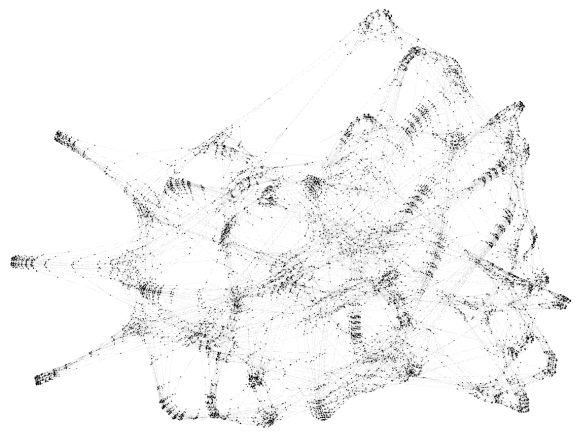
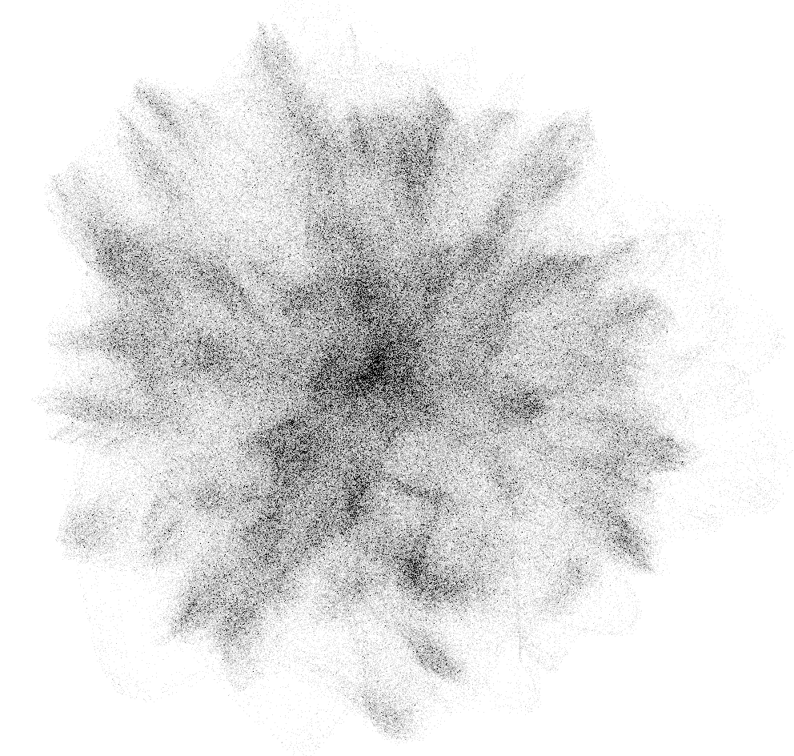

So far, we have focused on **n = 3 robots** to keep the model and explanations concise.
However, the Self-Sorting Robots specification is fully parameterized and can be scaled to *any* number of robots simply by changing the `roboCountTotal` value in the setup.

In this section, we explore what happens when we increase the number of robots — and the resulting complexity of the system’s state space.

## Benchmark Preview: Self-Sorting Robots in Action

The following transition systems were automatically generated using **BiGGer** and **GrGen.NET**, modeling the state space of multiple robots performing a physical bubble-sort along the grid.

[//]: # (| **N = 3 Robots**                                                                       | **N = 4 Robots**                                                                              | **N = 5 Robots**                                                                                  | **N = 6 Robots**  |)

[//]: # (|----------------------------------------------------------------------------------------|-----------------------------------------------------------------------------------------------|---------------------------------------------------------------------------------------------------|:--|)

[//]: # (| ![SSR3]&#40;../assets/ssr/lts-ssr3.png&#41;   Nodes: 78   Edges: 96   Time: 0.70 s | ![SSR4]&#40;../assets/ssr/lts-ssr4.png&#41;   Nodes: 1,263   Edges: 2,767   Time: 10.02 s | ![SSR5]&#40;../assets/ssr/lts-ssr5.png&#41;   Nodes: ≈ 9,192   Edges: 22,047   Time: 105.56 s | ![SSR6]&#40;../assets/ssr/lts-ssr6.png&#41;   Nodes: ≈ 9,192   Edges: 22,047   Time: 105.56 s  |)

| **N = 3 Robots**                                                                       | **N = 4 Robots**                                                                              |
|----------------------------------------------------------------------------------------|-----------------------------------------------------------------------------------------------|
|    Nodes: 78   Edges: 96   Time: 0.70 s |    Nodes: 1,263   Edges: 2,767   Time: 10.02 s |

| **N = 5 Robots**                                                                                  | **N = 6 Robots**                                                                                 |
|---------------------------------------------------------------------------------------------------|--------------------------------------------------------------------------------------------------|
|    Nodes: ≈ 9,192   Edges: 22,047   Time: 105.56 s |    Nodes: ≈ 314,226   Edges: 1,003,215   Time: 19459.07 s |

**Interpretation:**
- Each **dot** is a reachable system state.
- Each **edge** is a transition caused by applying a reaction rule.
- Larger N means *many more* possible configurations and paths.
- Graphs were rendered from `.dot` files using [Gephi](https://gephi.org/).

### Observations

- The growth of the state space is **combinatorial**. Adding just one more robot drastically increases the number of states and transitions.
- Execution time increases accordingly, even with optimized model-checking through GrGen.NET.
- Such a structure of the graph (i.e., transition system) reveals *sorting “phases”* and could be used to detect possible *deadlocks or cycles* if rules are misconfigured.
    - Question: Does behavior possess a compositional structure?
### Takeaway

Scaling SSR beyond small values of N is an excellent stress test for:
- **Model checker performance**
- **Rule design correctness**
- **Visualization tooling** for large graphs

