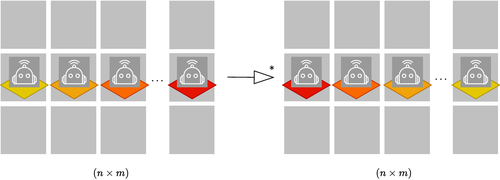

This tutorial models and simulates a **Self‑Sorting Robots (SSR)** system in the Bigraph Framework.

 

 

We’ll build a grid, place three robots, define synchronization and movement rules, then run a BFS model check to explore all behaviors until the robots are sorted by ID.

You will also see how the compositional nature of bigraphs helps to generalize this for *n* robots and not only three.

**What you’ll learn**
- Combine environment and agent components into one bigraph
- Encode synchronization with locks (`SLck`, `SLckRef`)
- Drive motion using movement tokens and waypoints
- Explore behaviors via reaction graphs

The complete code can be found here:
[SelfSortingRobots.java](https://github.com/bigraph-toolkit-suite/bigraphs.grgen-bigraphs/blob/main/src/test/java/org/bigraphs/grgen/converter/usecase/selfsortingrobots/SelfSortingRobots.java)
