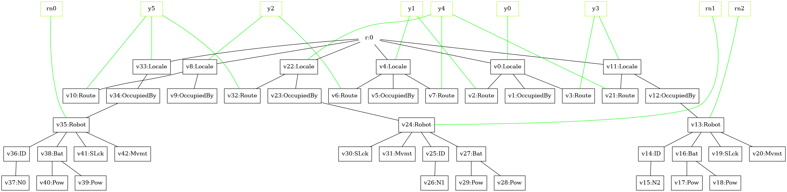
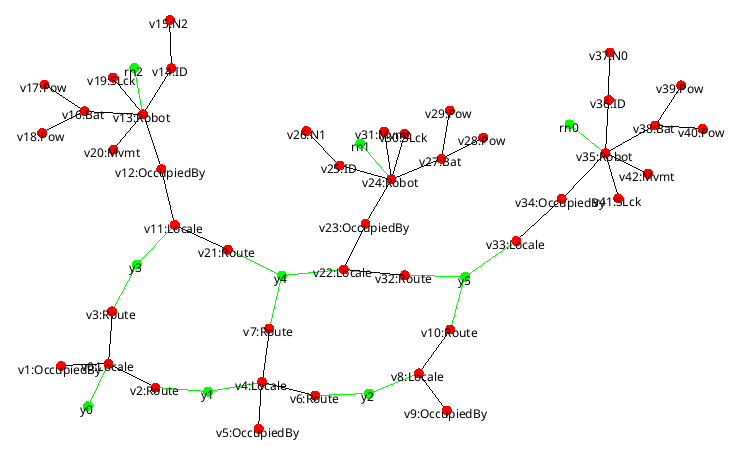

We start with three robots on a 2×3 grid.

```java
int roboCountTotal = 3;                 // three robots
String gridFile = "2x3_unidirectional";

PureBigraph grid = createBigrid(gridFile);              // loads XMI grid
// Place robots into the grid's sites; last index is where we start placing (right to left)
PureBigraph robots = initRobots(grid.getSites().size(), roboCountTotal, 2*roboCountTotal - 1);
PureBigraph agent  = ops(grid).nesting(robots).getOuterBigraph();
```

Cells of the grid are unidirectionally linked in this example.

Each robot looks like: OccupiedBy( Robot<sub>rid</sub> ( ID(Ni), Bat(Pow...), SLck, Mvmt ) ).

:::tip
You can visualize the PNG/XMI with the framework’s visualization/export modules.
:::

If you export the agent (optional):

```java
eb(agent, "ssr_agent_3R_2x3grid", "src/test/resources/dump/selfsortingrobots/");
```


<center>
<small>Initial configuration: three robots deployed on a 2×3 grid, fully represented as a bigraph model.</small>
</center>


<center>
    <small>Same initial configuration as before but using a different layout algorithm.</small>
</center>