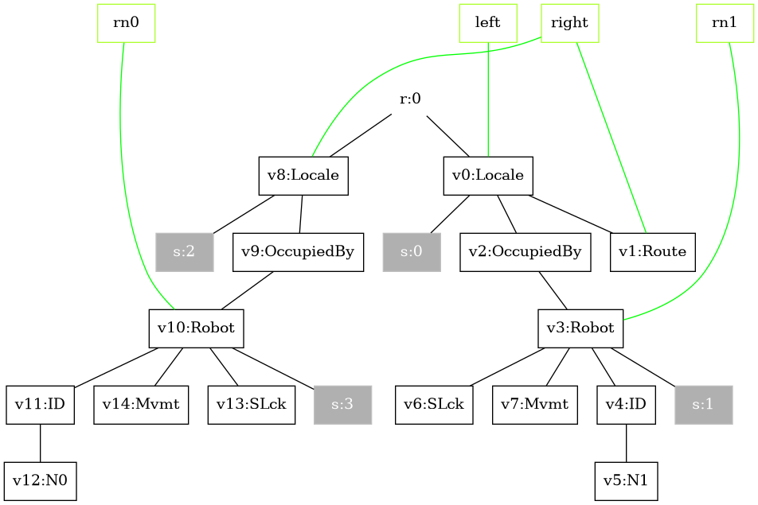
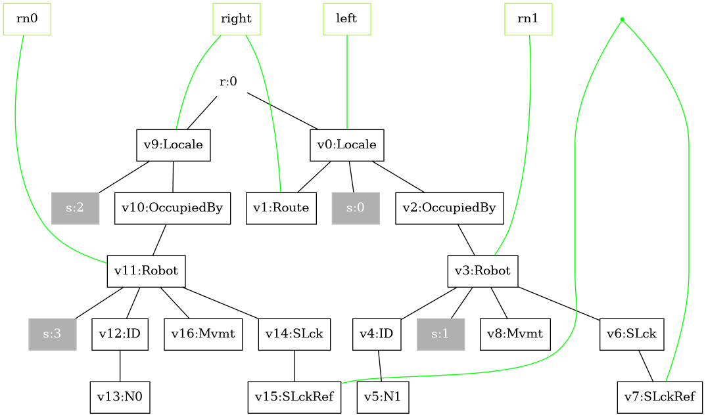
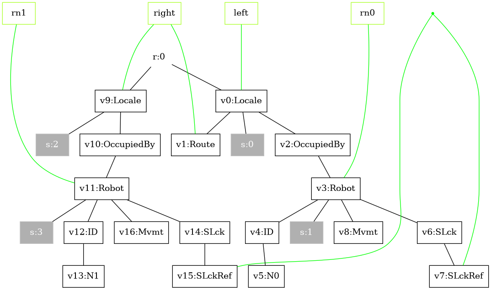
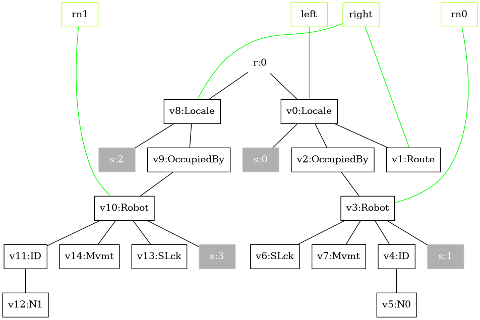

We’ll use four rule families regardless of the number of robots:

## 1. Start synchronization — `startSync(i, j)`

Matches adjacent robots with `i > j`, installs a shared lock (`SLckRef`) so they can coordinate.

```java
// Example: sync robot 1 with robot 0 (since 1 > 0)
ReactionRule<PureBigraph> r1 = startSync(1, 0);
```

### Intuition

Here, *i* and *j* represent robot IDs.
Think of `startSync(1, 0)` as:

> “If Robot 1 is next to Robot 0 and they are not yet locked, create a lock between them so they can coordinate their next moves.”

The lock (`SLckRef`) is like a handshake:
> “We’re now linked — only we two will coordinate until this lock is released.”

<details>
<summary><strong>Understanding <code>startSync(1, 0)</code></strong></summary>

### Purpose

The `startSync(i, j)` reaction rule models the **initiation of synchronisation** between two neighbouring robots.
It is only applicable if the **left-hand robot’s ID `i` is greater than the right-hand robot’s ID `j`** (`i > j`).
This constraint enforces the sorting logic — the "larger" robot should move past the "smaller" one.
Since the robots moving on a grid, the physical constraints are encoded explicitly.

---

|||
-----------------------------------------|----------------------------------------|
|Left-hand Side of the Rule|Right-hand Side of the Rule|
---

#### **LHS – Before synchronisation**

On the **left-hand side**, the bigraph pattern matches:

- **Two adjacent locales**:
  - `Locale`<sub>left</sub> containing `Robot` with ID `N0`
  - `Locale`<sub>right</sub> containing `Robot` with ID `N1`
- Each robot is wrapped in an `OccupiedBy` container and has:
  - `ID` node holding its identity (`N0`, `N1`)
  - `Mvmt` node (movement control)
  - `SLck` node (lock) with **no references**
- There is **no shared link** between their `SLck` nodes — robots are independent.

**Preconditions matched:**
- Robots are *adjacent* in the grid environment.
- IDs satisfy `i > j` → in our example, `1 > 0`.
- Neither robot is yet synchronised.

---

#### **RHS – After synchronisation**

On the **right-hand side**:

- The same two `Locale`/`Robot` structures remain in place.
- Both `SLck` nodes now have a `SLckRef` child linked to the **same inner name** `"x"`.
- This inner name represents a **shared lock** — a communication channel between these two specific robots.

**Effect of the rule:**
- Positions, IDs, and movement tokens remain unchanged.
- The only modification is adding the **shared lock reference** so that further rules (`initMovePattern`, `moveRobotWaypoint`, `endSync`) can safely operate on this pair.

</details>

## 2. Initialize movement pattern — `initMovePattern()`

Adds `Token`s under `Mvmt` and waypoint nodes so that a move can occur.

```java
ReactionRule<PureBigraph> r2 = initMovePattern();
```

## 3. Move along waypoint — `moveRobotWaypoint()`

Consumes one `Token` and moves a robot from a source `Locale(src)` to a target `Locale(tgt)`.

```java
ReactionRule<PureBigraph> r3 = moveRobotWaypoint();
```

## 4. End synchronization — `endSync(i, j)`

Releases locks when the exchange is done.

```java
// Example: release sync between robot 0 and robot 1 (0 < 1 for end)
ReactionRule<PureBigraph> r4 = endSync(0, 1);
```

### Intuition

Here, *i* and *j* are robot IDs.
Think of `endSync(0, 1)` as:

> “If Robot 0 and Robot 1 are currently locked together, remove that lock so they can each continue interacting with other robots.”

The `SLckRef` link is removed, effectively breaking the private communication channel between the two robots.

<details>
<summary><strong>Understanding <code>endSync(0, 1)</code></strong></summary>

### Purpose

The `endSync(i, j)` rule models the termination of synchronisation between two neighbouring robots.
It only applies if the left-hand robot’s ID i is smaller than the right-hand robot’s ID j (i < j).
This complements the startSync rule — after cooperation or an exchange, the link is removed.

---
|||
-----------------------------------------|----------------------------------------|
|Left-hand Side of the Rule|Right-hand Side of the Rule|
---

#### **LHS – Before releasing**

On the left-hand side:

- **Two adjacent locales:**
    - Locale<sub>left</sub> contains Robot with ID `N0`
    - Locale<sub>right</sub> contains Robot with ID `N1`
- Each robot has:
    - An `ID` node for its identity
    - A `Mvmt` node
    - An `SLck` node containing a `SLckRef` child
- Both `SLckRef` nodes are linked to the **same inner name**, indicating they are currently locked together.

**Preconditions matched:**

- Robots are adjacent.
- IDs satisfy `i < j` → here `0 < 1`.
- They are already synchronised.
---

#### **RHS – After releasing**

On the **right-hand side**:

- The same Locale and Robot structures remain.
- The SLckRef children have been removed from both SLck nodes.
- The robots are now “free” — no shared lock link remains.

**Effect of the rule:**
- The robots retain their positions, IDs, and other attributes.
- The only change is the removal of the shared lock, making them available for future synchronisations with other robots.

</details>


> These functions are taken from the [SSR unit test](https://github.com/bigraph-toolkit-suite/bigraphs.grgen-bigraphs/blob/main/src/test/java/org/bigraphs/grgen/converter/usecase/selfsortingrobots/SelfSortingRobots.java): they build the LHS/RHS bigraphs including interfaces and tracking maps.