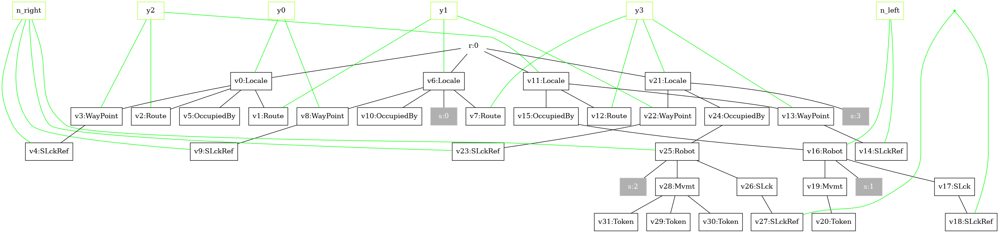
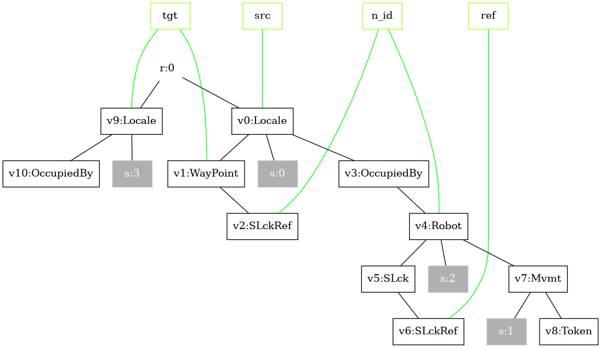
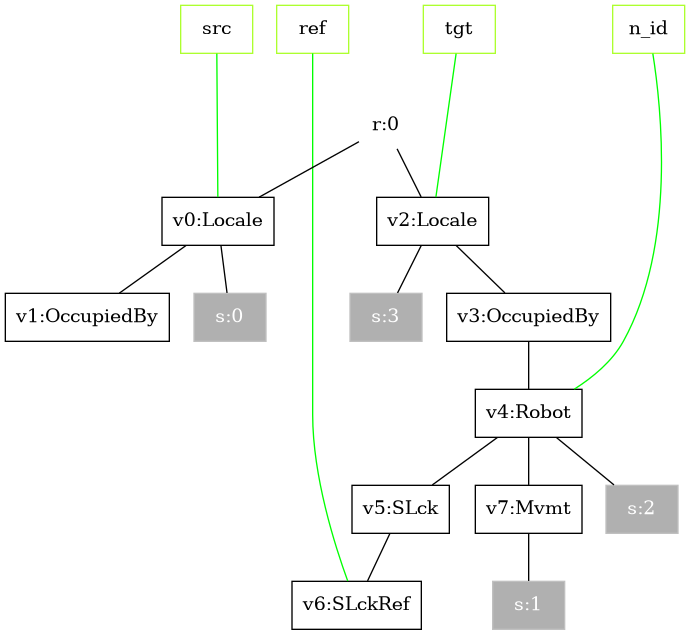

:::info
These functions are taken from the [SSR unit test](https://github.com/bigraph-toolkit-suite/bigraphs.grgen-bigraphs/blob/main/src/test/java/org/bigraphs/grgen/converter/usecase/selfsortingrobots/SelfSortingRobots.java): they build the LHS/RHS bigraphs including interfaces and tracking maps.
:::

We use four rule families (meta-rules, template rules) to parameterize the system by the number of robots:

## 1. Start synchronization: `startSync(i, j)`

Matches adjacent robots with `i > j`, installs a shared lock (`SLckRef`) so they can coordinate.

```java
// Example: robot 1 (left) synchronizes with robot 0 (right).
ReactionRule<PureBigraph> r1 = startSync(1, 0);
```

Here, *i* and *j* represent robot IDs.
Think of `startSync(1, 0)` as:

> "If Robot 1 is next to Robot 0, and they are not yet locked, create a lock between them so they can coordinate their next moves."

The lock (`SLckRef`) is like a handshake:
> "We're now linked — only we two will coordinate until this lock is released."

<details>
<summary><strong>Understanding <code>startSync(1, 0)</code></strong></summary>

The `startSync(i, j)` reaction rule models the initiation of synchronisation between two _neighbouring robots_.
It is only applicable if the left-hand robot’s ID `i` is greater than the right-hand robot’s ID `j` (`i > j`).
This feature is encoded _spatially_.
This constraint enforces the sorting logic. The "larger" robot should move past the "smaller" one.
Since the robots moving on a grid, the physical constraints is native and encoded explicitly.


|||
-----------------------------------------|----------------------------------------|
|Left-hand Side of the Rule|Right-hand Side of the Rule|


**Before synchronisation (LHS)**

- Two adjacent locales:
  - `Locale`<sub>left</sub> containing `Robot` with ID `N0`
  - `Locale`<sub>right</sub> containing `Robot` with ID `N1`
- Each robot is wrapped in an `OccupiedBy` container and has:
  - `ID` node holding its identity (`N0`, `N1`)
  - `Mvmt` node (movement control)
  - `SLck` node (lock) with no references
- There is no shared link between their `SLck` nodes, i.e., robots are independent.

**Preconditions matched:**
- Robots are *adjacent* in the grid environment.
- IDs satisfy `i > j` → in our example, `1 > 0`.
- Neither robot is yet synchronised.

---

**After synchronisation (RHS)**

- The same two `Locale`/`Robot` structures remain in place.
- Both `SLck` nodes now have a `SLckRef` child linked to the same edge (private link).
- This edge represents a shared lock, i.e., a communication channel between these two specific robots.

**Effect of the rule:**
- Positions, IDs, and movement tokens remain unchanged.
- The only modification is adding the shared lock reference so that further rules (`initMovePattern()`, `moveRobotWaypoint()`, `endSync()`) can safely operate on this pair.

</details>

## 2. Initialize movement pattern:  `initMovePattern()`

Adds `Token`s under `Mvmt` and installs **waypoint bindings** so that the subsequent move rule (`moveRobotWaypoint`) has something concrete to consume and follow.

```
ReactionRule<PureBigraph> r2 = initMovePattern();
```

Think of `initMovePattern()` as:

> "Now that two robots are synchronized (share a lock), give them a *movement plan*."

That plan consists of two ingredients:

- `Token`(s) under each robot’s `Mvmt`: permission/energy to perform a bounded number of moves.
- Waypoints: links that encode *where a robot is allowed to move next* (e.g., "from left locale to right locale" and vice versa).

Without this rule, `moveRobotWaypoint()` (next rule) would have nothing to "spend" (no token) and no "direction" (no waypoint).

<details> <summary><strong>Understanding <code>initMovePattern()</code></strong></summary>

`initMovePattern()` is the bridge between "robots are locked together" and "robots can actually start swapping positions".
It prepares the local configuration so that movement becomes a controlled, step-by-step process, according to a fixed pattern.

Controlling the drone is performed by attaching drones to waypoints.

|||
|-----------------------------------------|----------------------------------------|
|Left-hand Side of the Rule|Right-hand Side of the Rule|

#### **Before movement initialisation (LHS)**

- Four neighbouring `Locale`s, two containing a `Robot` (via `OccupiedBy`).
- The two robots are already synchronised:
    - each robot has an `SLck` node
    - each `SLck` contains an `SLckRef`
    - both `SLckRef`s are linked to the same edge (shared lock channel)
- Each robot already has an `Mvmt` node, but it has no active "movement resources" yet:
    - no `Token`
    - no waypoint bindings that would tell the robot which `Route`/target locale to follow

**Preconditions matched:**

- The robots are adjacent.
- They are already privately paired (via the shared lock).
- The path has not been defined yet.

------

#### **After movement initialisation (RHS)**

- Under each robot's `Mvmt`, one or more `Token` nodes are created.
- These tokens represent discrete movement steps that can later be consumed by `moveRobotWaypoint()`.
- The rule also installs waypoint links:
    - it binds names (outer) so that a robot's movement control is connected to the appropriate `Route` structure
    - conceptually, this encodes "next hop" information: *source locale* to *target locale*
- Importantly, positions do not change yet:
    - locales, robots, IDs, and the shared lock remain as-is
    - only the movement machinery is added

**Effect of the rule:**

- Robots remain synchronised and stationary.
- Each robot gains:
    - a finite budget to move (`Token`s), and
    - a direction/plan (waypoint bindings)
- The configuration is now ready for repeated application of `moveRobotWaypoint()` (next rule) until tokens are exhausted (or until the exchange is completed and `endSync(i, j)` releases the lock).

</details>

## 3. Move along waypoint:  `moveRobotWaypoint()`

Consumes one `Token` and moves one `Robot` from a source `Locale` to a target `Locale` by following the installed waypoints.

```
ReactionRule<PureBigraph> r3 = moveRobotWaypoint();
```

Think of `moveRobotWaypoint()` as:

> "If a robot has a movement token, and its current locale has a waypoint that points to a neighbouring target locale, then spend one token and move the robot to that target locale."

<details> <summary><strong>Understanding <code>moveRobotWaypoint()</code></strong></summary>

This rule is the actual step that changes positions in the bi-grid.
Everything before it (`startSync()`, `initMovePattern()`) only *prepares* the configuration; this one performs the movement.

|||
|-----------------------------------------|----------------------------------------|
|Left-hand Side of the Rule|Right-hand Side of the Rule|

A useful way to read the diagram is via the outer names (green): `src`, `tgt`, `ref`, `n_id`.

- `src` : the locale the robot is currently in
- `tgt` : the neighbour locale it is allowed to move to
- `ref` : the "route/waypoint reference channel" (installed by `initMovePattern()` with corresponding lock nodes `SLck` and `SLckRef`)
- `n_id` : the shared lock/name channel used to keep the synchronised pair consistent while moving

**Before movement (LHS)**

- There is a source locale`Locale` that currently contains the robot:
- It has an `OccupiedBy` which contains a `Robot`.
- The robot has a resource `Mvmt` that still contains at least one `Token`:
- This token represents "one step of permission to move".
- The source locale also contains a `WayPoint` node.
- This waypoint is *linked* to a drone.
- The robot remains synchronised (it still has an `SLck` with an `SLckRef`), and the lock identity is preserved.

---

**After movement (RHS)**

- The robot is re-parented from the source `Locale` to target `Locale`
- Exactly one `Token` is consumed:
- The robot’s identity and synchronisation bookkeeping are preserved: the `SLck` / `SLckRef` structure is kept (still "locked" while moving).
- The waypoint reference is maintained consistently so further moves (if more tokens remain) can proceed in the same controlled fashion.

**Effect of the rule:**

- Movement: re-parent the entire Robot sub-tree from the source `Locale` to the target `Locale` designated by the `WayPoint` binding, while preserving the robot's synchronisation structure (`SLck` and `SLckRef`, i.e. the same lock identity).
- Tokens enforce bounded, step-by-step motion (no "teleporting" multiple locales at once).
- Waypoints ensure the robot moves only along allowed neighbour relations (the "direction/route" is encoded as links, not as arithmetic or global state).
- Keeping the **lock channel** (`n_id`) intact ensures the two robots can keep coordinating until `endSync(i, j)` finally releases the lock.

</details>


## 4. End synchronization: `endSync(i, j)`

Releases locks when the exchange is done.

```java
// Example: release sync between robot 0 and robot 1 (0 < 1 for end)
ReactionRule<PureBigraph> r4 = endSync(0, 1);
```

Here, *i* and *j* are robot IDs.
Think of `endSync(0, 1)` as:

> “If Robot 0 and Robot 1 are currently locked together, remove that lock so they can each continue interacting with other robots.”

The `SLckRef` link is removed, effectively breaking the private communication channel between the two robots.

<details>
<summary><strong>Understanding <code>endSync(0, 1)</code></strong></summary>

The `endSync(i, j)` rule models the termination of synchronisation between two neighbouring robots.
It only applies if the left-hand robot’s ID i is smaller than the right-hand robot’s ID j (i < j).
This complements the startSync rule. After cooperation or an exchange, the link is removed.


|||
    |-----------------------------------------|----------------------------------------|
|Left-hand Side of the Rule|Right-hand Side of the Rule|


#### **Before releasing (LHS)**

- Two adjacent locales:
    - Locale<sub>left</sub> contains Robot with ID `N0`
    - Locale<sub>right</sub> contains Robot with ID `N1`
- Each robot has:
    - An `ID` node for its identity
    - A `Mvmt` node
    - An `SLck` node containing a `SLckRef` child
- Both `SLckRef` nodes are linked to the same edge, indicating they are currently locked together.

**Preconditions matched:**

- Robots are adjacent.
- IDs satisfy `i < j` → here `0 < 1`.
- They are already synchronised.
---

#### **After releasing (RHS)**

- The same Locale and Robot structures remain.
- The `SLckRef` children have been removed from both `SLck` nodes.
- The robots are now "free". No shared lock link remains.

**Effect of the rule:**
- The robots retain their positions, IDs, and other attributes.
- The only change is the removal of the shared lock, making them available for future synchronisations with other robots.

</details>
