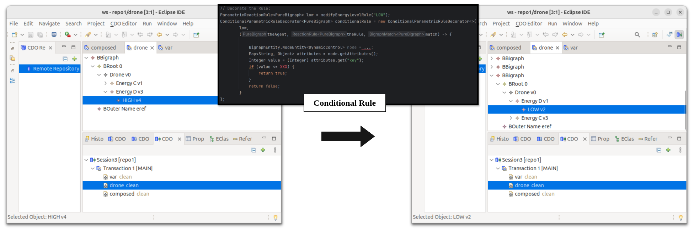

## Rule Creation

Now, we are defining a parametric rule to change the energy level of the drone.
We want a rule that replaces the current energy marker under `EnergyD` with a specific level (here: `LOW`):

```java
private ParametricReactionRule<PureBigraph> modifyEnergyLevelRule(String energyLevel)
        throws Exception {

    PureBigraphBuilder<DynamicSignature> redexB   = pureBuilder(sig());
    PureBigraphBuilder<DynamicSignature> reactumB = pureBuilder(sig());

    // Redex: Drone + EnergyC/Ref/eref + EnergyD + VarSpace/Var linked via inner "tmp"
    redexB.root()
        .child("Drone").down()
            .site()
            .child("EnergyC").down().child("Ref").linkInner("tmp").up()
            .child("EnergyD").down().site()
        .top()
        .child("VarSpace").down().child("Var").linkInner("tmp").down().site();
    redexB.closeInner("tmp", false);

    // Reactum: same context, but EnergyD now contains the energyLevel node
    reactumB.root()
        .child("Drone").down()
            .site()
            .child("EnergyC").down().child("Ref").linkInner("tmp").up()
            .child("EnergyD").down().child(energyLevel)
        .top()
        .child("VarSpace").down().child("Var").linkInner("tmp").down().site();
    reactumB.closeInner("tmp", false);

    // Instantiate the sites appropriately
    InstantiationMap instantiationMap = InstantiationMap.create(2);
    instantiationMap.map(0, 0);
    instantiationMap.map(1, 2);

    return new ParametricReactionRule<>(redexB.create(), reactumB.create(), instantiationMap);
}
```

## Adding an Attribute-Based Condition

We don’t want to always apply the rule.

Instead, only when `Ni.key <= 500`.

We wrap the parametric rule into a `ConditionalParametricRuleDecorator` that inspects the attributes of the current agent:

```java
ParametricReactionRule<PureBigraph> low = modifyEnergyLevelRule("LOW");

ConditionalParametricRuleDecorator<PureBigraph> conditionalRule =
    new ConditionalParametricRuleDecorator<>(
        low,
        (theAgent, theRule, match) -> {
            BigraphEntity.NodeEntity<DynamicControl> Ni = theAgent.getNodes().stream()
                .filter(x -> x.getControl().getNamedType().stringValue().equals("Ni"))
                .findFirst()
                .orElseThrow(() -> new RuntimeException("Node 'Ni' not found"));

            Map<String, Object> attributes = Ni.getAttributes();
            if (attributes.get("key") != null) {
                Integer value = (Integer) attributes.get("key");
                return value <= 500;
            }
            return false;
        }
    );
```

This is the **conditional part**: the bigraph rewrites only when the current ROS2 value stored in the node satisfies the guard.