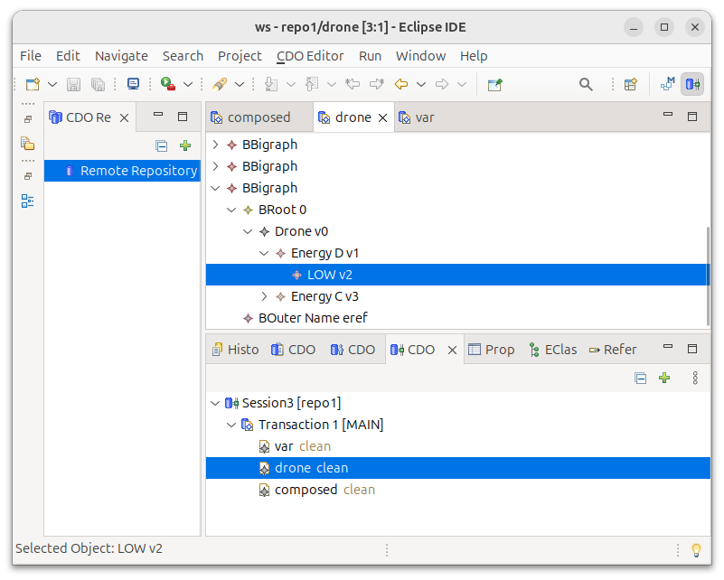
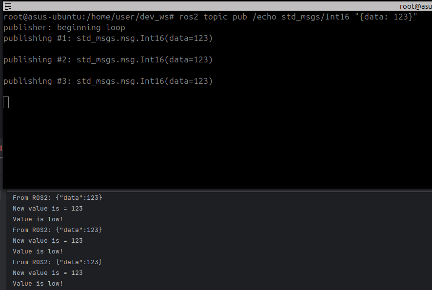

Now we are dealing with composing, matching, and rewriting only the drone part of the model.
Therefore, we continuously:

- Reload `/drone` and `/var` from the CDO repository.
- Compose them into a full bigraph.
- Look for matches of the rule.
- If `conditionalRule` is satisfied, and we haven’t just matched (`canMatchAgain`), apply the conditional rule.
- Update `/composed` and overwrite only the drone part in `/drone`.

```java
AbstractBigraphMatcher<PureBigraph> matcher =
        AbstractBigraphMatcher.create(PureBigraph.class);

while (true) {
    Thread.sleep(100);

    // 1) Reload both parts
    PureBigraph bVarPart   = toBigraph(MM, template.find(cdoIdVar,   EObject.class, "/var"),   sig());
    PureBigraph bDronePart = toBigraph(MM, template.find(cdoIdDrone, EObject.class, "/drone"), sig());

    // 2) Compose into full model
    PureBigraph fullModel = merge(bDronePart, bVarPart, true);

    // 3) Find matches for the non-conditional rule
    Iterator<BigraphMatch<PureBigraph>> iterator =
            matcher.match(fullModel, low).iterator();

    if (iterator.hasNext()) {
        BigraphMatch<PureBigraph> match = iterator.next();

        // 4) Check attribute-based condition and throttle via canMatchAgain
        if (conditionalRule.isMatchValid(bVarPart, conditionalRule, match)
                && canMatchAgain.get()) {

            System.out.println("Value is low!");
            canMatchAgain.set(false);

            // 5) Apply reaction and persist results
            PureBigraph result =
                    new PureReactiveSystem().buildParametricReaction(fullModel, match, low);

            // Update composed model
            template.insert(result.getInstanceModel(), "/composed");

            // Decompose to get updated drone part only and persist it
            PureBigraph dronePartDecomposed = decompose(result, matcher);
            EObject inserted = template.insert(dronePartDecomposed.getInstanceModel(), "/drone");
            cdoIdDrone = CDOUtil.getCDOObject(inserted).cdoID();
        }
    }
}
```

A few important points:
- Only attributes of `/var` change; its structure stays the same. Therefore, we do not need to update the CDO ID or model for `/var`.
- The structural change (switching `EnergyD.HIGH` to `EnergyD.LOW`) is contained in the drone part, which is decomposed from the full result and overwrite in `/drone`.
- `/composed` always holds the latest composed state of the system.

The helper method `decompose()` uses a context-extraction rule (`getDroneContextRule`) and some bigraph algebra to recover a drone-specific part from the complete model.

## Screenshots

|Before|After|
|------|-----|
|||
|||


## Executing the Test

Run the main java class `Application.java` from your IDE or directly from the terminal:
```shell
# (3. Terminal)
$ mvn spring-boot:run
```

**Before**, make sure that the rosbridge websocket server and the CDO database is running:
```shell
# (1. Terminal)
# Rosbridge server
$ ros2 launch rosbridge_server rosbridge_websocket_launch.xml

# (2. Terminal)
# CDO
$ mvn test -DrunDisabledTests=true -Dtest="CDOStandaloneServerTest#run_server_test_01"
```

Then publish test messages on the ROS 2 topic:
```shell
# A sufficient low value
$ ros2 topic pub /echo std_msgs/Int16 "{data: 123}"

# A sufficient high value
$ ros2 topic pub /echo std_msgs/Int16 "{data: 2000}"
````


## Summary

You have now:

- Connected ROS2 to your Java bigraph application and streamed data into bigraph node attributes.
- Persisted a split bigraph using [Spring Data CDO](https://github.com/bigraph-toolkit-suite/spring-data-cdo), modifying only the relevant parts over time.
- Implemented a **conditional bigraph reaction rule** that inspects attributes, and used the simulation API to match and rewrite the model incrementally.
