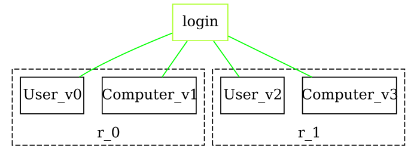
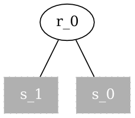
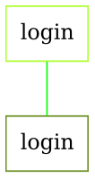
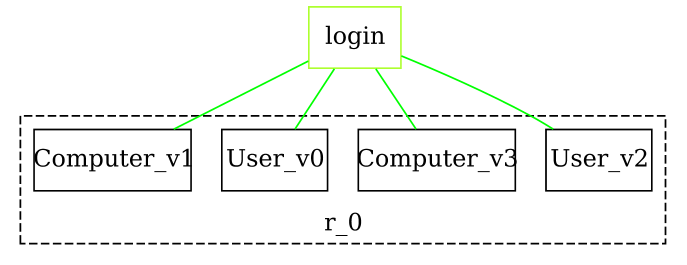

Discover what Bigraph Framework is all about and learn the core concepts behind it.

## Creating a Bigraph

At the moment, Bigraph Framework supports only pure bigraphs.

### Signature
We begin be opening a new pure factory.
All further operations will use the same factory in this context.
The first step is to create a signature by using the returned factory.
```java
import static de.tudresden.inf.st.bigraphs.core.factory.BigraphFactory.*;

@Test
void example() {
    PureBigraphFactory pureFactory = pure();

    DefaultDynamicSignature signature = pureFactory.createSignatureBuilder()
            .newControl().identifier("User").arity(1).kind(ControlKind.ATOMIC).assign()
            .newControl(StringTypedName.of("Computer"), FiniteOrdinal.ofInteger(2)).assign()
            .create();
}
```

The resulting signature contains 2 controls. The signature specifies the
syntax of a bigraph we are going to create in the following.
More about the specific methods of the bigraph factory and signature builder
can be found in section [Factories and Builders](./advanced/factories-and-builders).

### Builder

After that we are able to instantiate a builder instance.
With it we can build our bigraph by adding child nodes and connections among them.
The signature above determines which kind of nodes we can add to the bigraph.

```java
import static de.tudresden.inf.st.bigraphs.core.factory.BigraphFactory.*;

@Test
void example() throws InvalidConnectionException {
    // ...

    PureBigraphBuilder<DefaultDynamicSignature> builder = pureFactory.createBigraphBuilder(signature);
    builder.createRoot()
            .addChild("User", "login").addChild("Computer", "login");
    PureBigraph bigraph = builder.createRoot()
            .addChild("User", "login").addChild("Computer", "login")
            .createBigraph();
}
```
The example shows how to add two nodes ("User" and "Computer") under the same root twice,
and how to link all to the same _outer name_ with the label "login". The bigraph is illustrated below.

Note that the method `addChild` will throw an `InvalidConnectionException`
if the node cannot be connected to the outer name.




> See [Visualization](visualization) on how to export a bigraph
> as graphic file.


## Elementary Bigraphs

Let us now examine how more trivial bigraphs can be created which are
termed _elementary bigraphs_. Essentially, there are two categories:
Placings and Linkings.

Elementary bigraphs allow to build more complex bigraphs easily.
We show how to create a concrete placing first, before we are going to use
for composition later in the next section.

<!--Note on equality: Object equality at the instance level is not to be compared-->
<!--with mathematical equality of bigraphs. This is also know as bigraph isomorphism problem.-->

In the following, we create a so-called _merge_n_ which is a placing where
n sites are located under one root.

```java
@Test
void example() throws InvalidConnectionException {
    // ...

    Placings<DefaultDynamicSignature> placings = pureFactory.createPlacings(signature);
    Placings<DefaultDynamicSignature>.Merge merge = placings.merge(2);
    Linkings<DefaultDynamicSignature> linkings = pureFactory.createLinkings(signature);
    Linkings<DefaultDynamicSignature>.Identity login = linkings.identity(StringTypedName.of("login"));
}
```

The factory provides the method `createPlacings()` to create a placing builder.
With it we create a merge and passing the integer 2 as argument to create a merge
with two sites.
Further, we create an identity link graph with the name "login".

The two elementary bigraphs merge and identity are depicted below.

|Placing: Merge | Linking: Identity |
|---|---|
|  |   |


## Composition of Bigraphs

Bigraphs may be composed by using special operators. This allows us to
modularize bigraphs by constructing sub-structures separately from each other
and compose them later to build a larger bigraph.

To equip a bigraph with operators we simply pass it to the static method
`ops()` provided by the `BigraphFactory` class.

```java
@Test
void example() throws InvalidConnectionException {
    // ...

    BigraphComposite<DefaultDynamicSignature> composed = ops(merge).parallelProduct(login)
            .compose(bigraph);
}
```
The code above describes a composition that merges the two roots of `bigraph`
under one root node with index 0.

Note that composition may throw the following two exceptions `IncompatibleSignatureException` and `IncompatibleInterfaceException`
if the signatures are not the same or the interfaces are not compatible.
See [Theory](./advanced/theory) to get more details about how bigraphical
composition works. All available operators are explained in [Composition](composition).



## Conclusion

This page explored some of the basic features of the Bigraph Framework
on how to create signatures, bigraphs, elementary bigraphs and how to compose them to
form larger ones.